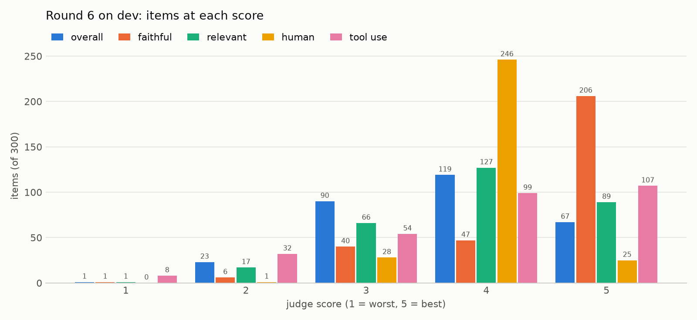

# Results — 2026-09-14

Target: `gemini-3.5-flash-lite`, default thinking. Judge: Sonnet subagents, rubric in `JUDGE.md`
(1–5 on faithful / relevant / human / overall). Dev = 300 held-out comments, stratified by source.
Screening on a fixed 40-item dev minibatch; the winner confirmed on full dev.

## Winner: `candidates/best.json` (= r2_ttw_plain_voice_hedged_D0)

| | overall | faithful | relevant | human | chrF |
|---|---|---|---|---|---|
| baseline (one-line instruction, no demos) | 2.70 | 3.02 | 3.13 | 2.78 | 0.256 |
| winner | **3.06** | 3.17 | 3.48 | 3.83 | 0.236 |

Paired on 256 dev items: 104 wins, 89 ties, 63 losses, mean +0.30. Gain is uniform across the
four sources (+0.22 to +0.36). Overall distribution of the winner: 1:10 2:74 3:77 4:83 5:13.

The winning instruction: silent board check first, then 1–4 plain sentences in an annotator's
voice, no markdown or hype adjectives, prefer plans and ideas over concrete tactics, at most one
verified concrete threat, no "who stands better". Three labelled demos (one GameKnot, one lichess
study, one PathToChessMastery, 150–350 chars).

## What moved the needle, what did not

- **Voice is fully steerable.** Plain-voice rules take human from 2.8 to ~4.0 in one step.
- **Faithfulness is capped by board reading, not by prompting.** Every variant sits at 2.3–3.2
  faithful. Prompts that ask for more checkable claims (checklists, "name the piece and square",
  contrastive alternatives) get *worse*: the model asserts more and misreads more. The only lever
  that helped was hedging, i.e. saying fewer checkable things.
- **Over-hedging collapses relevance.** Banning all threat language (r3_zero_threat) scored 1.62,
  the worst of 21 candidates: content-free prose.
- **Demos matter as much as the instruction.** Same instruction, demo set D0 3.02 vs D2 2.33;
  6 demos (D0+D1) worse than 3. Not fully separable from judge noise (see below).
- **Round 3 converged.** All four children of the winner scored below it on the minibatch.

## Caveats

- Judge noise is large: two judges on halves of the same run differ by up to 0.45 in mean overall.
  Minibatch rankings below ±0.15 are not reliable; the full-dev paired result is.
- chrF is uninformative here (all runs 0.23–0.32, and it prefers long output).
- 293 lichess-study examples with a set-up FEN were removed from the dataset mid-run; the dev set
  was rebuilt and 163 baseline scores carried over by (fen, comment) key.
- Residual faithfulness failures (wrong-piece 18, wrong-square 17, hallucinated-threat 19 of 257)
  would need a different input, e.g. a computed list of pieces per square or attacked pieces,
  not a different prompt. That is a task change and was not tried.

## Cost

~5,000 Gemini calls, about $1. 60 Sonnet judge/proposer subagents, ~7M tokens.

# Round 4 — 2026-09-15: lessons as context, thinking visible, open-ended diagnosis

Run `r4_best_lessons_think`: best.json unchanged, plus `chess_school_intro.md` (three ICS lessons,
~11k tokens) prepended verbatim, and Gemini thinking switched on (`thinkingLevel: medium`; the
previous run had *no* thinking, Flash-Lite's default). Judges (12 Sonnet, `JUDGE2.md`) saw the
thought summary and wrote free-text `mistakes` and `tools`; categories below were built from
reading all 300 notes, then made reproducible in `categorize_r4.py`.

| | overall | faithful | relevant | human | thinking_faithful |
|---|---|---|---|---|---|
| r2 winner (no lessons, no thinking) | 3.06 | 3.17 | 3.47 | 3.83 | — |
| r4 | 3.04 | **3.93** | 3.20 | 3.41 | 3.77 |

Paired on 257 items: overall −0.02 (83 W / 85 T / 89 L); faithful +0.77; relevant −0.28;
human −0.42. Per-batch overall ranges 2.36–3.32, i.e. judge noise as before. Two changes are
conflated (lessons + thinking); no control run.

Top-level split of the 300: 96 outputs contain a false claim, 101 are true but generic (miss
the point), 103 accepted (overall ≥ 4). Faithfulness rose because the model asserts less; the
human score fell because the lessons' vocabulary leaks ("qualitative value of my pieces", "to do
list") and voice drifts toward the textbook.

## Mistake categories (multi-label, n of 224 items with a note)

| n | category |
|---|---|
| 128 | true but generic: misses the hanging piece / fork / mate / tempo attack / plan that the reference is about |
| 37 | phantom or vanished piece: wrong occupant, wrong origin square, captured piece misidentified (Nxe7 "takes a rook", knight "trapped on a8" two moves after it was traded, "my e2 bishop" that is Black's) |
| 35 | geometry: piece said to attack/defend a square it cannot reach or that is blocked (Nf3 "defends e4", Rh2 "hits h5" through own h4 pawn, Bh6 "attacks g8") |
| 32 | evaluation inverted: praises a move the reference calls a mistake, or wrong side has the edge |
| 31 | material / count wrong: "rooks" with one rook, bishop pair with one bishop, down a rook unnoticed, "development complete" with pieces at home |
| 30 | square called undefended/weak/vacant that is covered or occupied |
| 28 | side / direction backwards: narrates from the wrong side, weakness assigned to the wrong side, attacks the wing where the king is not |
| 28 | thinking–output gap (see below) |
| 22 | light/dark bishop swapped (Stonewall and French "bad bishop" backwards in both texts) |
| 20 | pawn-structure mislabel: isolated vs doubled, backward, "passed" |
| 18 | "open file" with a pawn still on it |
| 15 | "forced" / "threat" where other legal replies exist or the capture is illegal (Bxc4 through own e2 pawn; Qxf7 with Nf6 interposed) |
| 15 | rooks "connected" / back rank "cleared" with pieces still between |
| 14 | lesson vocabulary leaked into the output |

Thinking vs output: in 25 items the thinking contains an error the output dropped or blurred
(the model's hedging instruction is doing its job); in 12 the output asserts something the
thinking never checked (e.g. a knight "in the corner" when Black has no knight). The thought
summaries are short (median 1.4k thought tokens) and rarely show square-by-square verification;
when they do, the misreads are already there.

## Tools the judges asked for (multi-label)

| n | tool |
|---|---|
| 98 | per-piece attack/defence map with blockers: what this piece reaches; what attacks/defends this square |
| 82 | piece inventory / occupancy: what sits on square X, king locations, material count, capture log |
| 68 | short forcing-line search: checks, forks, mates, discovered attacks, is candidate move X safe |
| 28 | hanging-piece scan (attackers vs defenders per piece, pin-aware) |
| 25 | pawn-structure classifier (isolated / doubled / backward / passed, weak squares) |
| 21 | board predicates: back-rank connectivity, development checklist, castling squares |
| 19 | opening book / named plans for the structure |
| 18 | square-colour / bishop-identity lookup |
| 17 | per-file pawn census (open / half-open / closed) |
| 12 | legal-move list / check-reply enumerator |
| 7 | engine eval / move comparison |
| 94 | none (76 clean items + 18 where the defect is voice, side of narration or judgement) |

Reading: the first two rows together cover nearly every factual error and are cheap
(python-chess, no search). The third row is what separates "true but generic" from the reference
and needs a shallow tactics search. Engine evaluation is almost never what the judges wanted.

## Cost

300 Gemini calls × ~12k prompt tokens ≈ 3.7M input tokens (< $1). 12 Sonnet judges ≈ 2.2M tokens.

# Round 5 — 2026-09-18: tool use (Gemini function calling over board_tools)

The model gets eight functions bound to the position after the move (`tools.py`: attack_map,
inventory, hanging, forcing, threats, legal, after, pawn_structure), a 35-line checklist
extracted from the ICS lessons (`chess_school_actionable.md`) instead of the 335-line lessons,
and a four-step recipe (`candidates/r5_tools.json`). Every call is logged per item; judges
(`JUDGE4.md`) see the call log and mark which calls the output relied on or contradicted.
A code-sandbox variant (`sandbox.py`, one `run_python` tool with python-chess and the same
functions, every call counted) lost to function calling on the train minibatch (overall 2.92
vs 3.10, 18 vs 5 items contradicting their own tool output): Flash-Lite reimplements the
lookups with raw Board calls and misreads the bitboard grids. Kept for line-checking only.

## Full dev (300)

| | overall | faithful | relevant | human |
|---|---|---|---|---|
| r2 winner (no tools, no thinking) | 3.06 | 3.17 | 3.47 | 3.83 |
| r4 (lessons + thinking) | 3.04 | 3.93 | 3.20 | 3.41 |
| **r5_tools** | 3.17 | **4.06** | 3.31 | 3.63 |

Paired: vs r2 (257) overall +0.15 (99 W / 81 T / 77 L), faithful +0.94, relevant −0.14,
human −0.19. vs r4 (300) overall +0.18, faithful +0.22, relevant +0.14, human +0.21.
Per-batch overall 2.96–3.48. Split: 94 false claim, 91 true but generic, 115 accepted
(r4: 96 / 101 / 103). Mean 6 calls and 16k tokens per item.

## Tool use, from the log

| tool | items calling it | calls | judged "output relies on it" | dead ends | answered no |
|---|---|---|---|---|---|
| inventory | 300 | 301 | 20% | 0 | 0 |
| attack_map | 298 | 433 | 50% | 1 | 0 |
| hanging | 280 | 283 | 33% | 0 | 0 |
| threats | 294 | 295 | 26% | 9 | 0 |
| forcing | 118 | 118 | 22% | 0 | 0 |
| legal | 76 | 117 | 26% | 13 | 13 |
| after | 97 | 140 | 34% | 25 | 0 |
| pawn_structure | 114 | 114 | 29% | 0 | 0 |

Corrected 2026-09-19. The earlier table counted 96 "failed calls" by grepping result text for
"not legal". That over-counted threefold: all 15 `hanging` hits were the legitimate clause
"defended, but the recapture is not legal", and half the `legal` hits were the tool answering a
question correctly in the negative. A **dead end** is a call the tool could not answer as asked
(wrong-side move, illegal target, unknown tool); **answered no** is a truthful negative. Real
total: 48 dead ends in 1801 calls, plus 13 negative answers.

The recipe's mandatory calls (inventory, attack_map, hanging, threats) are made on every item;
the optional ones (legal, after, forcing, pawn_structure) on a third. Dead ends are mostly
`legal`/`after` with a move for the wrong side. Faithfulness does not vary with the number of
calls (4.0–4.1 from 4 to 8 calls).

Per r4 wish: items whose r4 judge asked for a tool now call it in every case for the attack
map (98/98), inventory (82/82), hanging (27/28) and forcing (67/68); pawn structure 11/25,
legality 3/12. Faithful on those items: attack map 3.21 → 4.01, inventory 2.93 → 3.93,
hanging 3.64 → 4.21, forcing 3.84 → 4.07, pawn structure 3.72 → 3.76.

## What still goes wrong

88 of 300 outputs contradict a result the model itself fetched (mean faithful 2.76 vs 4.60 for
the rest): a net-negative capture from `forcing`/`threats` sold as a threat, a piece said to
defend a square its own attack_map line omits, a file called open that pawn_structure marks
half-open. The tool is called, read in thinking, and paraphrased wrongly at generation.
Judges name a missing call in 153 items, mostly `after` (51: the line the reference is about
was never tested) and `attack_map` on a second square (43).

Mistake categories (n of 231 items with a note): true but generic 67, evaluation inverted 47,
material/count 28, geometry 27, phantom piece 24, undefended square 22, open file 16.

Relevance and voice did not move: the tools fix facts, not the choice of point. Next levers:
force one `after` on the mover's main threat; return tool verdicts in words ("Nxe4 loses a
pawn") instead of `net -2`; a verification pass that re-checks the draft's named squares.

## Cost

340 Gemini items × ~6 calls ≈ 5.5M tokens (~$1.5). 20 Sonnet judges ≈ 4.5M tokens.

# Round 6 — 2026-09-19: inject the facts, keep three tools, write the evaluation out

Round 5 gave the model eight functions and 88 of 300 outputs contradicted a result the model
itself had fetched. Round 6 splits the tool layer by whether the answer depends on something the
model picks. Everything derivable from the position alone is computed in Python and injected as
a numbered fact sheet (`facts.py`, ~1.1k tokens, seven sections, most game-deciding first). Only
three lookups stay callable, because only these three take an argument the model chooses:
`after(moves)`, `legal(move)`, `attack_map(square)`.

The toolkit did not shrink, it inverted: 8 callable and 0 injected in round 5, against 3 callable
and 10 injected here. Five analyses moved out of the callable set (`inventory`, `hanging`,
`forcing`, `threats`, `pawn_structure`) and five new ones arrived that were never callable at all
(`positional.py`: `change` — the move's plus and its minus; `alternatives` — what other moves gave
up less, one ply deep; `king_safety`; `piece_quality`; `space`). The prompt (`candidates/r6_algorithm.json`)
is an explicit procedure: STEP 1 findings citing fact ids, STEP 2 pick the point, STEP 3 the
note, with `split_on: "NOTE:"` keeping only the note as `gen` and the rest as `eval`.

## Train minibatches (3 × 40, disjoint slices of one seed-0 shuffle)

Batch 0 is the same 40 items r5_tools and r5_code were judged on.

| batch 0, identical items | overall | faithful | relevant | human |
|---|---|---|---|---|
| r5_code | 2.92 | 3.65 | 3.40 | 3.40 |
| r5_tools | 3.10 | 4.05 | 3.48 | 3.38 |
| **r6_algorithm** | **3.58** | **4.30** | **3.83** | **4.05** |

Paired vs r5_tools: overall +0.47 (18 W / 17 T / 5 L), faithful +0.25, relevant +0.35,
human +0.68 (20 W / 20 T / 0 L — it never loses on voice).

Per minibatch: 3.58 / 3.23 / 3.67, spread 0.45. All 120: overall 3.49, faithful 4.23,
relevant 3.63, human 3.93. The spread is the reason for running three: a single 40-item screen
would have reported anywhere in that range. Each batch had a different judge, so the spread is
judge severity and item difficulty mixed, not item difficulty alone.

**Self-contradiction is fixed.** 9 of 120 items contradict their own tool result, against 88 of
300 (29%) in round 5. 0 dead-end calls in 160, against 48 in 1801. Mean 1.3 calls per item,
down from 6: `attack_map` 101, `after` 50, `legal` 9; 25 items called nothing.

## The verifier, model against human

`verify.py` checks a note's recognisable claims against python-chess. HARD classes exclude
`illegal move`, which flags 77 of 300 human comments because annotators name moves from
side lines and from later in the game — a diagnostic, never a deletion rule.

| | HARD | illegal move |
|---|---|---|
| human reference (dev 300) | 21 (7.0%) | 77 (25.7%) |
| r4 (dev 300) | 16 (5.3%) | 1 |
| r5_tools (dev 300) | 15 (5.0%) | 9 |
| r6_algorithm (train 120) | 4 (3.3%) | 0 |

On the identical batch-0 40: r5_tools 7 notes with a false claim, r5_code 3, r6 1. The model is
past the human annotator on literal board claims. Board facts are no longer the gap.

## What the written evaluation did, which is not what it was for

Only 82 of 120 items (68%) emitted `NOTE:` at all; the other 38 skipped STEP 1/2 and wrote just
the note. The compliant items score **worse** on every axis.

| | n | overall | faithful | relevant |
|---|---|---|---|---|
| wrote STEP 1/2 | 82 | 3.39 | 4.11 | 3.51 |
| skipped STEP 1/2 | 38 | 3.71 | 4.50 | 3.89 |

Part of that is confounded: the model reaches for the scaffold deeper into the game (median ply
47 vs 26), and ply predicts score hard (3.75 at ply 0–30 down to 3.20 past ply 60). Controlling
by ply band shrinks the gap from +0.30 to **+0.22 weighted**, but it keeps the same sign in all
four bands and never reverses (+0.23 / +0.03 / +0.48 / +0.18; n=3 in two bands).

So the scaffold is not proven harmful, but it is not earning its tokens either, and the round-6
gain looks like it comes from the injected fact sheet and the three-tool trim instead. The clean
test is an A/B on the same items: one arm with `NOTE:` forced, one with STEP 1/2 removed.

## Cost

Median 13.5k total tokens per item (11.5k prompt), against round 5's 16k. The fact sheet is
cheap; the worked example plus three demos is what costs. 120 items ≈ 1.6M tokens. 6 Sonnet
judges ≈ 1.3M tokens.

# Round 6 — full dev (300), 2026-09-25

`r6_algorithm` unchanged from the train screen. Judges: 12 Sonnet, `JUDGE6.md` — as JUDGE4 plus the
fact sheet and the written STEP 1/2 in the batch, `facts_used`, and a new **tool_use** score (1–5:
did the note's point rest on the deciding facts, read correctly, with any named line checked)
plus `tool_use_notes`. Judges saw more than round 5's did, so the cross-round comparison is not
under identical conditions.

| | overall | faithful | relevant | human | tool_use |
|---|---|---|---|---|---|
| r2 winner | 3.06 | 3.17 | 3.47 | 3.83 | — |
| r4 | 3.04 | 3.93 | 3.20 | 3.41 | — |
| r5_tools | 3.17 | 4.06 | 3.31 | 3.63 | — |
| **r6_algorithm** | **3.71** | **4.45** | **3.92** | **3.98** | 3.85 |

Paired overall: vs r5_tools (300) +0.54, 157 W / 81 T / 62 L; vs r4 (300) +0.72; vs r2 (257)
+0.67, 143 W / 64 T / 50 L. Faithful +0.39 vs r5, relevant +0.61, human +0.35. The train screen
(+0.47 vs r5 on batch 0) holds on dev. Overall distribution 1:1 2:30 3:89 4:115 5:65.

Per-batch overall 3.28–4.32, spread 1.04: wider than any earlier round. Batches 0–5 (items 1–150) score
3.28–3.56 and batches 6–11 score 3.68–4.32. Each batch has its own judge, so item mix and judge
severity cannot be separated.

Verifier (`verify.py`, HARD classes): 7 of 300 notes (2.3%) against 15 for r5_tools and 21 for the
human reference; 3 further "illegal move" flags.

## Tool use

| tool_use | n | overall | faithful |
|---|---|---|---|
| 1 | 10 | 2.00 | 2.10 |
| 2 | 36 | 2.69 | 3.06 |
| 3 | 53 | 3.25 | 4.36 |
| 4 | 91 | 3.77 | 4.69 |
| 5 | 110 | 4.37 | 4.97 |

tool_use correlates 0.77 with faithful and 0.70 with overall, 0.16 with human. It is not an
independent axis: the rubric scores a misread fact low on both. Where it adds information is
between 3 and 4, where faithful is already high and tool_use separates "true but picked the lesser
fact" from "picked the deciding one".

416 calls, 1.4 per item (attack_map 257, after 122, legal 37); 56 items called nothing. Notes
contradicting a fact or call result: 36 of 300 (faithful 2.75 vs 4.69 for the rest), against 88
in round 5. Judges name a missing lookup or fact in 134 items; the recurring one is `after` on
the line the note calls winning or losing. A few `legal`/`after` calls test the move already
played, from the position after it, and get "not legal".

## The fact sheet misjudges trades and sacrifices

The sheet's material verdicts are one ply deep. After a capture it reports the half-finished
exchange ("Black up 3"; the capturing piece "hanging, wins a piece") and the "was it careless"
block calls the capture careless. The model repeats this faithfully, and even trades get called
blunders: Bxf3 in the Caro-Kann, 4...dxc6 in the Ruy Lopez Exchange (5.Nxe5 Qd4 regains the pawn),
Bxf6 gxf6, Qxd1+ Kxd1. 12 of the 46 dev items whose move was a capture call it a loss; the judges
confirm about 9 as wrong (mean overall 2.58, faithful 2.83). The same blind spot hits sacrifices
and gambits (Queen's Gambit and Slav pawns, 15...e5, 18.Nb5 leading to mate) and tactics away
from the exchange square (a back-rank mate after 28.Rxg4). The sheet is reliable when the whole
exchange happens on one square.

Fix: score the move's material from the position before it, over the full exchange, and drop
"careless" when the move is itself a capture that the reply only recaptures. Needs a rerun of the
affected items.

## The written evaluation, on dev

198 of 300 wrote STEP 1/2, 102 skipped it. Overall 3.72 vs 3.69, faithful 4.46 vs 4.43. The
train-set gap (−0.30 for writing it out) does not replicate: the scaffold neither helps nor hurts.

## Cost

300 Gemini items, median 13.5k total tokens (11.5k prompt) ≈ 4.8M tokens. 12 Sonnet
judges ≈ 2.9M tokens, several of which fanned out to their own sub-agents.

## Trade fix (2026-09-25)

`facts.py` now counts a capture over the whole exchange: a "mid-exchange" line in section 1, the
recapture marked as finishing the trade in the hanging and capture lists, and the careless check
scoring each move as what it took minus what the reply wins back, with a recapture counted from
before the opponent's capture. The same rewrite fixes an older bug where a mating move scored as
the worst move. 153 dev sheets change; the substantive ones are the 46 captures.

The 11 dev items whose note called an even trade a loss were rerun (`r6_algorithm_tradefix`) and
judged by one Sonnet judge alongside their old notes, shuffled, each with the sheet it was given:

| 11 items | overall | faithful | relevant | human | tool_use |
|---|---|---|---|---|---|
| old sheet | 2.00 | 2.18 | 2.73 | 3.91 | 1.82 |
| fixed sheet | 4.00 | 4.27 | 4.09 | 4.00 | 3.82 |

Overall 9 W / 2 T / 0 L. Not fixed: 4...dxc6 in the Ruy Lopez Exchange still gets "Nxe5 wins a
clean pawn" (5...Qd4 regains it, two plies past what the sheet sees), and gambits, sacrifices and
tactics off the exchange square need a search. Four new notes call the recapture "forced" when
other replies are legal.

## Round 6 on dev, merged

Full-dev judges for 289 items, the paired judge's fixed-sheet scores for the 11.

| | overall | faithful | relevant | human | tool_use |
|---|---|---|---|---|---|
| r5_tools | 3.17 | 4.06 | 3.31 | 3.63 | — |
| r6_algorithm, merged | **3.76** | **4.50** | **3.95** | **3.98** | 3.88 |

Paired overall: vs r5_tools +0.59 (160 W / 85 T / 55 L), vs r4 +0.77, vs r2 +0.70 (257 items).
Verifier HARD 7 of 300. Notes contradicting a fact or call 33 (faithful 2.85 vs 4.71).
tool_use correlates 0.75 with faithful, 0.68 with overall, 0.16 with human.
