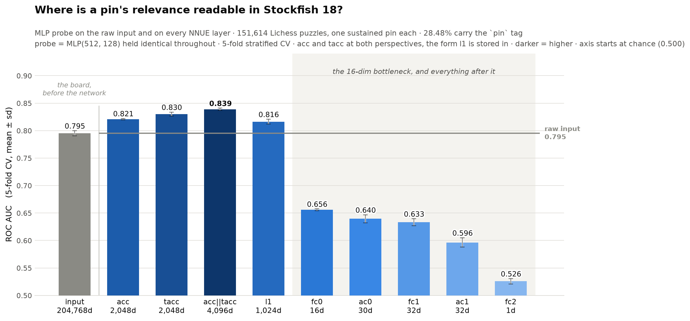
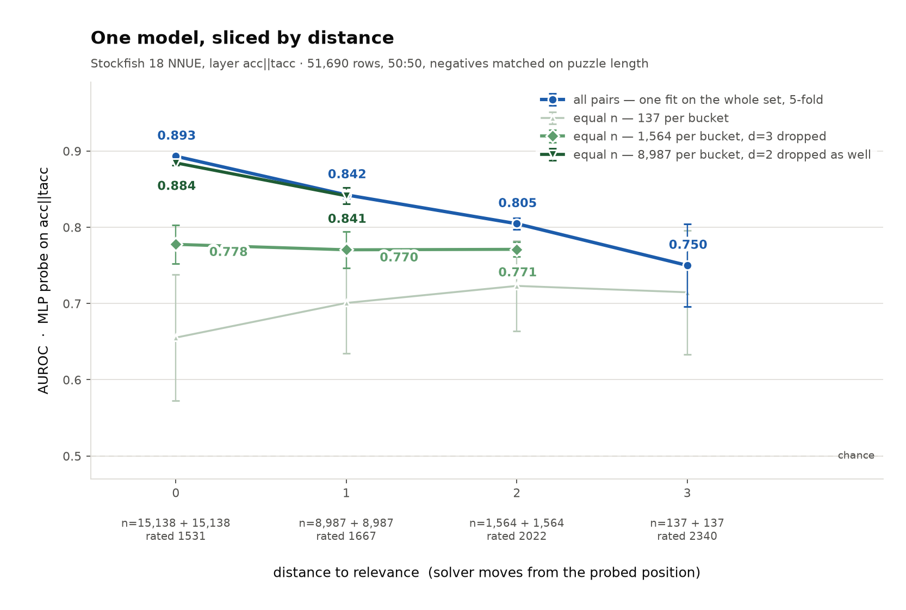
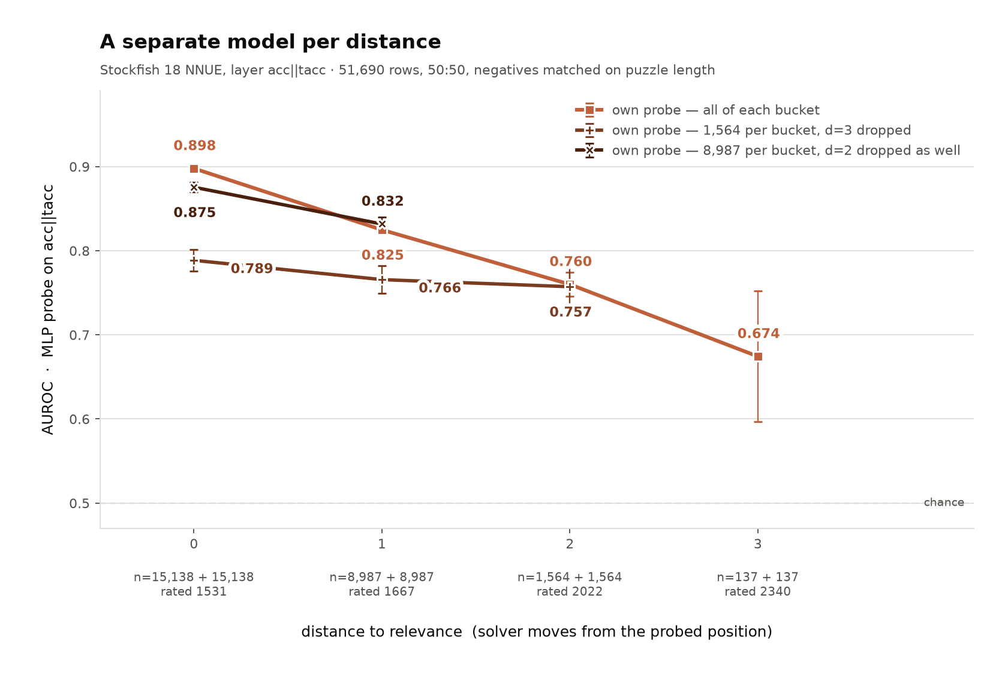
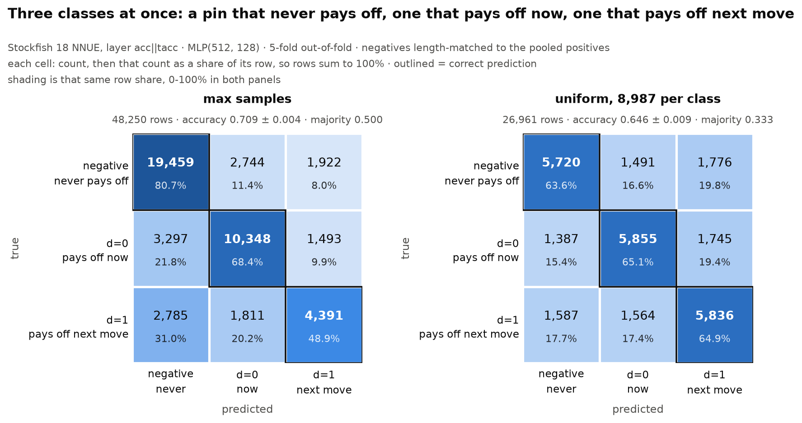
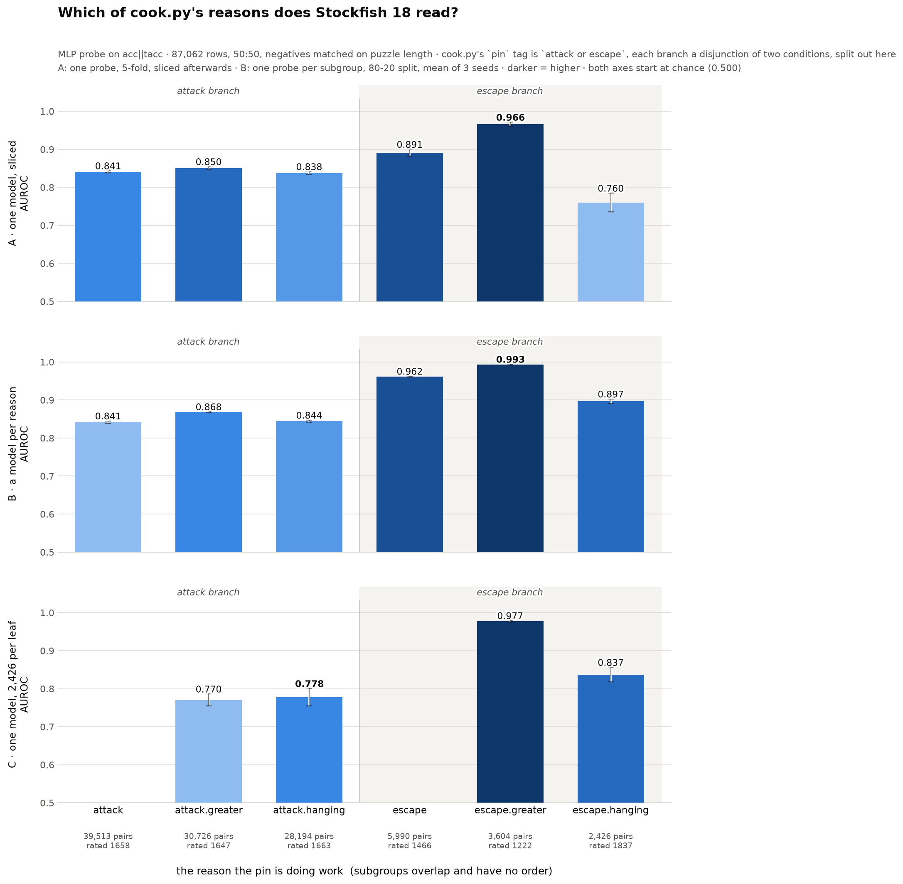
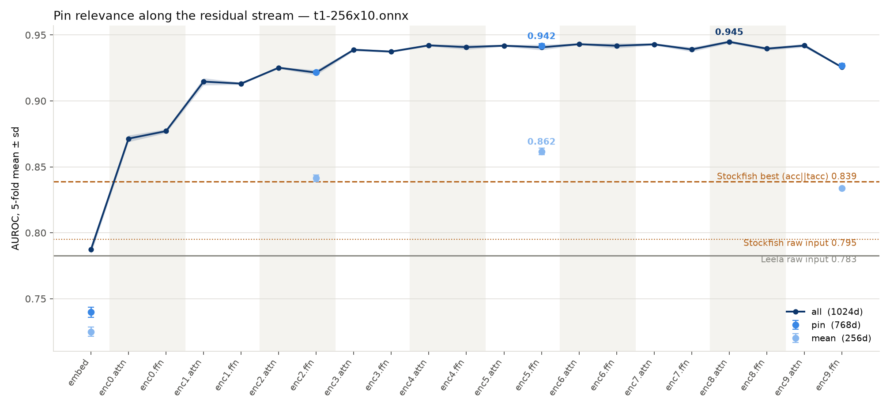
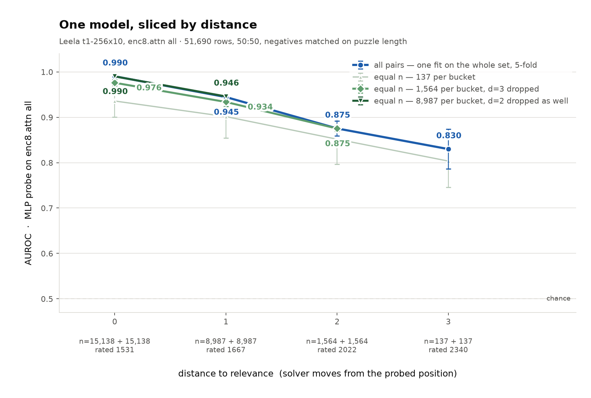
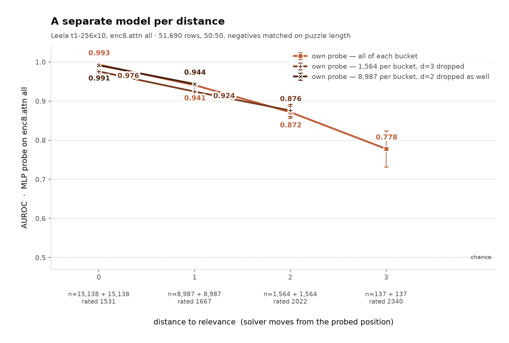

Previous (unguided) journey: https://typst.app/project/rhD6vG2m3c6TY3SA1Sy2hn

## First meeting 17.08. 

Mainly about general understanding

Approaches:
1. Feature attribution + LIME/SHAP
2. Tree search explanation (already some papers on this)
3. Feedback engine. The thesis: automatic feedback/validation is the most important part in the training process of any model
4. Transformer on Chess (ChessGPT + Chessformer) -> feasibility questionable -> possibly distillation
5. New approach discovered: Looking into the brain of the engine


Two main objectives:
1. Look into the brain of an engine with some simple concept
2. Develop a formal language for chess explanations
3. Read more papers on the two above

Finding: there is no existing formal language for chess explanations. There are only natural language chess explanations. Defining this formal language first, would already be a (possibly necessary) contribution. 

So let's start with that first:

### Objective 1

The goal is to find a formal language that can represent most existing chess explanations
while remaining verifiable by a relatively simple deterministic engine.  

Thoughts:
First, the task is already impossible from the beginning depending on how you define the word "most". 
    So, we should definitely stay humble and don't expect too much. 

Essentially, there are two main things that both humans and chess engines use
    - Tactics, calculating: going through different moves to a certain tree depth
    - Positional/Strategic, heuristics: certain patterns that are advantageous or disadvantageous, most easily evaluated and compared as numbers (e.g. "a queen is worth 9 points")

In engines, tactics is dealt with using tree search and positional evaluation is actually the crux of the matter done using neural networks. 

The number and complexity of the heuristics increases with playing strength. A lot of it is intuition, i.e. things that can actually not be expressed in natural language.

But let's just get to it. 
We can explain chess moves or we can do positional analyses. 
In some sense, you could say that the positional analysis is sufficient because any move can be justified by showing it leads to the best possible position (you can only do one move and there is a finite set of possible positions), but the more natural is to start with move explanations first. 

### Objective 1, first pass: my personal experience

My personal experience is that many move explanations mostly look like this: move X leads to Y or Z, Y leads to A and Z leads to B and A and B are both good (so X is good). It could of course be much less complicated "move X leads to A" or much more complicated (more width, more depth or more complex outcomes). Also you can reason using exclusion, or explain why move X is better than moves Y and Z, etc. 

This is the structure of explanations but we can also start from the bottom and look at the primitives of chess (and probably also our formal language):
- The board, its regions and squares
- The pieces both in abstract (a knight) and mostly the concrete (the knight on f3)
- A move

These primitives then interact with each other, e.g.
- This piece attacks this piece
- This piece pins that piece to this other piece
- This piece defends this square
- This piece controls this line/diagonal

So, I would start with listing the tactical patterns widely recognized by human chess players (this is from my personal experience + https://lichess.org/training/themes):
1. Hanging piece
2. Trapped piece
3. Fork
4. Pin
5. Skewer
6. Discovered check, discovered attack and clearance
7. Double check
8. Removing the defender and deflection
9. Interference
10. Attraction
11. Sacrifice
12. X-Ray attack and collinear move
13. Intermezzo (Zwischenzug)
14. Quiet move 
15. Zugzwang
16. and more

+ lots of kinds of mates

So now let's move to the positional part. 

Some heuristics
- Mates are really good
- Knights are bad at the edge of the board
- Golden Opening rules
- In the endgame, win pawns and promote pawns
- In the beginning, protect your king and hide it away, in the endgame put it into the center of the board

The problem with these in general is that they often might be wrong, you can basically always invent new ones, and there are different people and cultures with more or less slightly different sets of these and there might be some intuitive, not fully expressed or expressable heuristics as mentioned above. 

But let's go at this in a more structured way by looking at the literature

### Objective 1, second pass: Literature

The Russian chess school is one of the most influential chess cultures dominating the world for a long time and coincidentally it's most defining feature is its focus on positional play, so it definitely is a good starting point.

Main positional evaluation criterias:
1. Material
2. Pawn structure
3. Piece activity
4. Space and Control
4. Initiative and Attack
5. King Safety

### Objective 1, third pass: Simple Validation on Feng et al. (Minimal Maynard Coding)

TODO -> next week

### Objective 2: Existing work

There already is some literature on looking into the engine both on Stockfish (SF) and on an open source replica of Deepminds AlphaZero.

e.g.
IJCAI 2023 — "Unveiling Concepts Learned by a World-Class Chess-Playing Agent."


### Objective 2: Experiment setup

My original plan was to use the Lichess puzzle tags.

Specifically, I set up the following experiment:

First we take only puzzles with a single clearly identifiable pin that is sustained throughout the puzzle.
Now the assumption is that of those puzzles, all those pins are significant where the corresponding puzzle has an official Lichess pin tag.
The goal is then to train a NN that can for a given position accurately detect whether the pin is significant. 

Then we can look into how deep the engine can look into the future (i.e. how good it is at puzzles of varying length) and in which layer of the engines NN this information is mostly represented. 

This would be an advancement to the papers because we aren't just probing presence but relevance. 

The idea was to view the Lichess tags as human-labeled data considering the fact that Lichess has a human voting system.
However, the tags are mainly added through a relatively smart automatic system and then put up to vote, and are only added or removed if enough people voted for it. 

Automatic tagging works basically like this:
```py
if pin_prevents_attack(puzzle) or pin_prevents_escape(puzzle):
    tags.append("pin")
```

So, I let Claude Code write the engine patch to get out the NNUE computations from SF and filtered out the puzzles with a single identifiable absolute pin. Of those 151,614 puzzles 43,177 (28.48%) are tagged with `pin`. 3260 (~7,55%) originally automatically tagged puzzles have the tag removed, seemingly by human vote. This was computed by comparing the automatic system against the real tag in the lichess database. 

#### What does the Stockfish evaluation NN look like

Good general overview
https://github.com/official-stockfish/nnue-pytorch/blob/master/docs/nnue.md

Overview by Claude for SF 18

┌─────────────────────────┬────────────────────────────────────────────┬──────────────────────────────────────────┐
│         tensor          │                   shape                    │                   note                   │
├─────────────────────────┼────────────────────────────────────────────┼──────────────────────────────────────────┤
│ active feature indices  │ ≤32 HalfKA + ≤128 threats, ×2 perspectives │ the input                                │
├─────────────────────────┼────────────────────────────────────────────┼──────────────────────────────────────────┤
│ accumulation            │ 2 × 1024 int16                             │ linear in the input                      │
├─────────────────────────┼────────────────────────────────────────────┼──────────────────────────────────────────┤
│ threatAccumulation      │ 2 × 1024 int16                             │ linear in the input                      │
├─────────────────────────┼────────────────────────────────────────────┼──────────────────────────────────────────┤
│ transformer output (L1) │ 1024 uint8                                 │ 2 persp × 512 pairs — first nonlinearity │
├─────────────────────────┼────────────────────────────────────────────┼──────────────────────────────────────────┤
│ fc_0_out                │ 16 int32                                   │ index 15 is the skip term                │
├─────────────────────────┼────────────────────────────────────────────┼──────────────────────────────────────────┤
│ ac_sqr_0 ‖ ac_0         │ 30 uint8                                   │ not 32 — fc_1 is AffineTransform<30,32>  │
├─────────────────────────┼────────────────────────────────────────────┼──────────────────────────────────────────┤
│ fc_1_out                │ 32 int32                                   │                                          │
├─────────────────────────┼────────────────────────────────────────────┼──────────────────────────────────────────┤
│ ac_1_out                │ 32 uint8                                   │                                          │
├─────────────────────────┼────────────────────────────────────────────┼──────────────────────────────────────────┤
│ fc_2_out                │ 1 int32                                    │ the eval                                 │
└─────────────────────────┴────────────────────────────────────────────┴──────────────────────────────────────────┘

### Some reading


General problem for explanations: What can I assume the target user to already know? What is obvious to him?

https://arxiv.org/pdf/2510.25775
SHAP on chess pieces

The idea is very simple: Just take the best method for XAI and apply it to chess in a way, that chess engines already respresent in their internal neural networks.

Use cases they show:
1. Piece values -> Question: Wouldn't it be enough to just remove the piece and look at the evaluation delta? Or in other words, how much better is SHAP really for this?
	For example in the given position in Figure 4 the bishop delta is -6,2-3,8 = -10 and the knight delta is 8,9-3,8 = 5,1. This also matches the results from the SHAP evaluation (this only works for limited depths of course, because at greater depths the engine reaches the end state. 
	Their analysis is even slightly flawed, as they only consider the difference in evaluation of the pieces but it seems like the Black pawns loose value because of the existence of the bishop
2. Showing differences between


SHAP would be much more interesting on hand-crafted explainable features

In general, a completely black-box approach is difficult to be very successful???


https://arxiv.org/pdf/2306.09200

Essentially just GPT trained on chess data. 
Question: would fine-tuning be sufficient?

Really interesting would be to ask the model for reasoning for their move, or combine with CoT.


Probably one of the best, most valuable papers
https://arxiv.org/pdf/2605.19091

Chessformer

A unified model that combines raw strength (like SF or LC0), human-like play (like MAIA) and interpretebility

Main interesting idea: 
token representation and positional encoding
pure transformer (sota arch) with geometric attention, that actually adapts to the geometric properties of chess.
lc0 distillation

Some papers on faithfulness metrics for CoT

https://arxiv.org/pdf/2502.18848 -> Causal model
https://arxiv.org/pdf/2605.25052 -> BonaFide, ground truth
https://arxiv.org/pdf/2307.13702 &
https://arxiv.org/pdf/2305.04388 -> Different faithfulness measurements, relatively uninteresting
https://arxiv.org/pdf/2004.03685 -> Fundementals on faithfulness

Learned look-ahead in lc0: https://arxiv.org/pdf/2406.00877

https://ir.cwi.nl/pub/30850/30850.pdf

MCTS explanation: some ideas I had as well for explaining tree search
- Selecting the most important branches
- Summarising branches
	Some natural language examples: 
		"Whatever White does here, Black can play X"
		"Wherever the King moves, he is mated"
		etc.

Why not this alternative? -> Important if the reason is not obvious, and then should be included in selecting the most important branches. 
-> We need to measure importance of a move/difficulty of an explanation

Very similar: https://arxiv.org/pdf/2503.23326

A0
https://arxiv.org/pdf/2111.09259

Probing
Manual inspection
Changing model weights in response to increasing training

## Second meeting 31.08.

### Feedback

Keywords: activation oracle, symbolic learning, circuits 

Next week
1. Mini Maynard Coding 
2. Stockfish, depth
3. Leela -> Transformer architecture is more similar to LLM research

### Objective 2: Simplicity

In the original demo I had reduced each layer to 16 dimensions using SVD to keep everything comparable in a logistic regression, but to keep it simple, I just did an MLP on the raw vectors for each layer instead which gives a quite nice result.



### Objective 2: Depth

The next question was trying to find out how far the net could look into the future essentially.

The experiment above was trying to understand which layer was best at understanding whether a pin was relevant in the puzzle. 
Now we want to find out if it is easier to see that the pin is relevant if it becomes relevant closer in time.
To decide this we can use Lichess' automatic tagging code which goes through the puzzle and looks at where the pin becomes relevant. 
We call this the relevance distance `d`. 

#### Score by distance class trained seperately
So, first instinct is to plot score over `d`.

However, there is one major problem:

Puzzles with higher relevance distances occur less often

| distance | n | mean rating | mean length |
|---|---|---|---|
| 0 | 15138 | 1531 | 1.64 |
| 1 | 8987 | 1667 | 2.13 |
| 2 | 1564 | 2022 | 3.07 |
| 3 | 137 | 2340 | 4.07 |
| 4 | 14 | 2362 | 5.07 |
| 5 | 4 | 2551 | 6.00 |
| 6 | 1 | 2489 | 7.00 |
| negative | 105789 | 1635 | 2.07 |

So the naive approach cannot be trusted if a majority of the puzzles have d=0. 
For this reason, I tried to keep the number of puzzles used in training uniform over d. This didn't really work when d=3 with just 137 puzzles is kept. But especially at several thousand samples we clearly see that the result from the naive approach is actually correct: It is easier to see a pins relevance when it's closer. 



The next step was looking at what happens when we train a seperate model for each depth, choosing negative samples of the same length as the positive samples. Also, I used the opportunity to do a 1:1 ratio between positive and negative samples. 

#### Score by distance class trained seperately



What we can see is that training the model on just puzzles with d=0 for example doesn't make the model better at detecting relevance. Also, the plot almost didn't change. 

#### Classifier

Just for fun, I wanted to try to train a model to predict between the classes d=0, d=1 and negative, if we remove everything else. 



#### Types of pin relevances

The real question is if there are different types of relevances that are more easily detectable than others apart from the relevance depth?

Lichess doesn't really distinguish many different types

1. pin prevents attack vs escape
2. the attacked piece is hanging or more valuable than the pinned piece/the pinned piece is hanging or more valuable than the piece attacking it

This gives 4 options:
1. `attack.hanging`
2. `attack.greater`
3. `escape.hanging`
4. `escape.greater`



What we see is that escape is consistently easier to read, specifically `escape.greater`


### Objective 3

Goal is to look at the layers of Leela Zero (lc0) just like we looked at Stockfish. 

Before making the experiment the hypothesis was that lc0 would be much better compared to SF because it has a much larger GPU-based tranformer network and there were already some papers showing its trained lookahead in contrast to SF which relies more heavily on tree-search:

1. "Evidence of Learned Look-Ahead in a Chess-Playing Neural Network" by Erik Jenner, Shreyas Kapur, Vasil Georgiev, Cameron S. Allen, Scott Emmons, and Stuart Russell, published at NeurIPS 2024 (arXiv:2406.00877)
2. A 2025 follow-up paper, "Understanding the learned look-ahead behavior of chess neural networks"

#### Experiment

On each layer we have a 256-vector per square which gives 256x65=16384 dimensions.

To keep training feasible, we did two main things:
First we have the pin subset, which is the three squares that are directly involved in the pin. 
Then we have the mean of all squares. 



### Objective 1: Example of some chess commentary

The chess commentary is from this paper: ChessGPT: Bridging Policy Learning and Language Modeling


Looking into chess commentary, we can see a lot of redundant simple commentary actually. 

1. Opening
2. Opening
3. Opening/Reference to normal play
4. Factual comment
5. Positional analysis
4. Purpose
5. Explanation (this is what we are actually looking for, in this case a concrete line, with two final reasons, just like we predicted)
6. Psychology
7. Psychology
8. Explanation (Only option that achieves A)
9. Explanation (do X to achieve A)
10. Positional analysis
11. Factual comment, psychology, explanation (Move X because after a some move later open file is occupied which enables move Y which treatens moves Z and W with mate)

Looking at the commentary, it would actually be very easy to build a simple deterministic system to write this commentary. 

#### Precedent: [Jhamtani et al. (ACL 2018)](https://aclanthology.org/P18-1154.pdf)


They already show that the commentary we are looking for, specifically "Planning/Rationale" and what they are calling "Direct Move Description" is also the most difficult to understand for language models. 

The other categories seem pretty simple to solve or are in the contrary almost impossible to generate from just the game itself.
1. Describing a move (what I called purpose) is mostly natural language processing. The most difficult part about this is the high variability. A move often does a lot of things, picking one shows taste. 
2. Move quality is very simple to do just with engines. This is also what chess.com and others are already very good at doing.
3. Comparing alternatives is just a certain way of reasoning, this also includes the exclusion principle, i.e. I am doing this move, because there is no better one. 
4. Planning and rationale is what we are looking for. It actually explains not just what a move is doing in the immediate, but also what the greater plan is that the move is part of
5. Contextual information ad general game comments are not feasible in this setting but would be important in practice. However, they require more context and are out-of-scope for now. 

Chess.com example (https://www.reddit.com/r/chessbeginners/comments/10cwkvw/why_does_chesscom_say_this_is_a_blunder_i/)


### Predicate Logic?

One possible basis for our language would be something like Prolog:

https://www.cs.rochester.edu/u/nelson/courses/csc_173/predlogic/computation.html

"Example facts:
```prolog
male(adam).
female(anne).
parent(adam,barney).
```

Example rules:

    son(X,Y) :- parent(Y,X) , male(X)
    daughter(X,Y) :- parent(Y,X) , female(X)
  
To run a Prolog program the user must ask a question (goal) by stating a theorem (asserting a predicate) which the Prolog interpreter tries to prove.

If the predicate contains variables, the interpreter prints the values of the variables used to make the predicate true. 
"

For example we could define an absolute pin as the following (more Python-like pseudo-code):

```py
absolute_pin (N,M,K) :- ours(N) and theirs(M) and theirs(K) and is_king(K) and (
        (rook(N) or queen(N)) and on_line_in_order(N,M,K)
    ) or (
        (bishop(N) or queen(N)) and on_diagonal_in_order(N,M,K)
    )
```

### Back to some chess literature

Main idea is to "distill" SF's evaluation function to some more simple model on explainable factors.
For that we need to understand what the factors are. 

So, let's look more at the chess literature. Specifically, literature from the International Chess School (www.chessmasterschool.com) and even more specifically their sample chess lessons from here (https://www.chessmasterschool.com/#program):

1. Think Like a Strong Player
2. Chess Strategy
3. Chess Tactics


Their theses:
1. For each move think about and evaluate the threats and consequences
2. Keep a TODO list with goals you want to achieve (over 3-10 moves)
3. Each move should either give you an advantage or remove an advantage from your opponent

#### What are these advantages?

Wilhelm Steinitz's 9 advantages
1. lead in development
2. mobility of the pieces
3. seizure of the center
4. weak oponnent king position
5. weak squares in the opponent's position
6. superior pawn formation
7. (a pawn majority on the queen side)
8. open files
9. (bishop pair)

The ICS proposes more modern quantitative and qualitative advantages

Quantative
1. Material advantage
2. local superiority of forces

Quantitave advantages are most easy to measure and compare.

Material advantage is probably one of the first things you learn and was the basis for engine evaluations until recently (it has changed to winning probability):

- Pawn: 1 (the unit)
- Knight: 3
- Bishop: 3
- Rook: 5
- Queen: 9

For this reason, knights and bishops are often called light pieces while rooks and queens are called heavy pieces.

The local superiority is quite simple to understand. The chess board is just large enough that locality exists, where something could be happening on one part of the board, where one party has the upper hand just like on a battle field. 

One heuristic: an attack on the opponents king will be successful if you have three more pieces in the attack than the opponent has in the defense. 

Essentially this is global material advantage vs local material advantage. This should be realtively easily measurable. 

Qualitative
1. King's safety (my own sub category)
    - pawns infront intact
    - open files and diagonals to king
    - how many pieces attack and how many defend (attacking and defending resources)
    - Example for worst possible king safety: https://lichess.org/analysis/r2q1rk1/pppb1p2/2n1p3/3pP2Q/3P4/3BB3/PPP2P2/2K3RR_b_-_-_0_1?color=white
2. Qualitative value of pieces
    - Mobility: 
        1. how many fields can the piece move to and 
        2. how little moves does the piece need to cover the entire board
    - Positioning
        1. knight in the center 4x4
        2. other pieces on open lines/diagonals
        3. the more central and the more squares under control, the better
    - Role: tiered
        1. Out of play
        2. Defensive
        3. Offensive
        4. Both offensive and defensive
    - Stability: Can it be removed from its position easily?
        - Existence of outposts -> potential
    - Grade of coordination -> difficult to assess
        1. Sustainment
        2. Protection
        3. Limitation
        4. Attack
        5. Obstruction
3. Pawn structure
    - number of pawn islands
    - isolated pawns
    - free pawns
    - double and triple pawns
    - pawn mobility
4. Space advantage
    - Better control of a certain area of the chessboard by advancing pawns
    - Space advantage increases the qualitative value of pieces -> don't trade if you have space advantage
    - Example where White has maximal space advantage: https://lichess.org/analysis/r1bqnrk1/pp1nbpp1/2p1p2p/2PpPP2/PP1P2PP/2NB1N2/1BQ5/2KR3R_w_-_-_0_1?color=white&position=518
        The evaluation is +6, even though materially there is no difference
5. Initiative
    - Forcing the opponent to respond to your threats instead of his own plans 

For PMEs (positions with material equivalence) also:
1. play-coordinating piece is valued higher

#### Positional evaluation

1. Material (as above)
    - if unequal material, compare
    - if material disadvantage, check compensation
2. Threats and tactical ressources
    - checks, takes, threats
3. King's safety (as above)
4. The centre
    1. control: score as 0-4 to 4-0
    2. type
        - closed
        - open
        - static
        - mobile
        - dynamic
5. Pieces
    1. Development (only in early game)
    2. Pieces out of play
    3. Local superiority
    4. Collaboration
    5. Rooks on open files
    6. Bishops on important diagonals
    7. Knights on important foreposts
    8. Bishop-pair
    9. Safe and active queen
    10. Piece-by-piece comparison
6. Pawns
    1. Space
    2. Weak pawns
    3. Superior pawn structure
    4. Dynamic
    5. Mobile pawn majority
    6. Free pawn

### Extra

Exact space counting method in "Winning Chess" by Silman and Seirawan. 

Other thought: ChessGPT + engine + tools

Eval:
1. LLM judge/human review
2. blue/rouge, embedding similarity
3. keywords/tool calls/structured output

Questions: how large does my eval set need to be?

Possibly: 100 or 1000

dspy
CLIP2 on chess
activation oracle on leela activation -> where do we get the data?


## Third meeting 10.09.

For next time:
1. Features bauen (mit Claude)
2. Paper, sparse autoencoder on engine -> schauen
3. Activation oracle nochmal verstehen
4. Datensatz aufräumen?
5. Minimalen Gold-Datensatz bauen
6. ChessGPT/Claude/Gemini + Prompt (zero-shot)
7. Datensätze suchen
8. PoC: Pin relevance mit LLM

### lc0 depth

Forgot at last meeting:





Leela actually reaches 99.3% AUROC on depth 0 and then also degrades quite heavily. No substantial lookahead to be seen. 

