Previous (unguided) journey: https://typst.app/project/rhD6vG2m3c6TY3SA1Sy2hn

## First meeting 17.08. 

Mainly about general understanding

Approaches:
1. Feature attribution + LIME/SHAP
2. Tree search explanation (already some papers on this)
3. Feedback engine. The thesis: automatic feedback/validation is the most important part in the training process of any model
4. Transformer on Chess (ChessGPT + Chessformer) -> feasibility questionable -> possibly distillation
5. New approach discovered: Looking into the brain of the engine


Two main objectives:
1. Look into the brain of an engine with some simple concept
2. Develop a formal language for chess explanations
3. Read more papers on the two above

Finding: there is no existing formal language for chess explanations. There are only natural language chess explanations. Defining this formal language first, would already be a (possibly necessary) contribution. 

So let's start with that first:

### Objective 1

The goal is to find a formal language that can represent most existing chess explanations
while remaining verifiable by a relatively simple deterministic engine.  

Thoughts:
First, the task is already impossible from the beginning depending on how you define the word "most". 
    So, we should definitely stay humble and don't expect too much. 

Essentially, there are two main things that both humans and chess engines use
    - Tactics, calculating: going through different moves to a certain tree depth
    - Positional/Strategic, heuristics: certain patterns that are advantageous or disadvantageous, most easily evaluated and compared as numbers (e.g. "a queen is worth 9 points")

In engines, tactics is dealt with using tree search and positional evaluation is actually the crux of the matter done using neural networks. 

The number and complexity of the heuristics increases with playing strength. A lot of it is intuition, i.e. things that can actually not be expressed in natural language.

But let's just get to it. 
We can explain chess moves or we can do positional analyses. 
In some sense, you could say that the positional analysis is sufficient because any move can be justified by showing it leads to the best possible position (you can only do one move and there is a finite set of possible positions), but the more natural is to start with move explanations first. 

### Objective 1, first pass: my personal experience

My personal experience is that many move explanations mostly look like this: move X leads to Y or Z, Y leads to A and Z leads to B and A and B are both good (so X is good). It could of course be much less complicated "move X leads to A" or much more complicated (more width, more depth or more complex outcomes). Also you can reason using exclusion, or explain why move X is better than moves Y and Z, etc. 

This is the structure of explanations but we can also start from the bottom and look at the primitives of chess (and probably also our formal language):
- The board, its regions and squares
- The pieces both in abstract (a knight) and mostly the concrete (the knight on f3)
- A move

These primitives then interact with each other, e.g.
- This piece attacks this piece
- This piece pins that piece to this other piece
- This piece defends this square
- This piece controls this line/diagonal

So, I would start with listing the tactical patterns widely recognized by human chess players (this is from my personal experience + https://lichess.org/training/themes):
1. Hanging piece
2. Trapped piece
3. Fork
4. Pin
5. Skewer
6. Discovered check, discovered attack and clearance
7. Double check
8. Removing the defender and deflection
9. Interference
10. Attraction
11. Sacrifice
12. X-Ray attack and collinear move
13. Intermezzo (Zwischenzug)
14. Quiet move 
15. Zugzwang
16. and more

+ lots of kinds of mates

So now let's move to the positional part. 

Some heuristics
- Mates are really good
- Knights are bad at the edge of the board
- Golden Opening rules
- In the endgame, win pawns and promote pawns
- In the beginning, protect your king and hide it away, in the endgame put it into the center of the board

The problem with these in general is that they often might be wrong, you can basically always invent new ones, and there are different people and cultures with more or less slightly different sets of these and there might be some intuitive, not fully expressed or expressable heuristics as mentioned above. 

But let's go at this in a more structured way by looking at the literature

### Objective 1, second pass: Literature

The Russian chess school is one of the most influential chess cultures dominating the world for a long time and coincidentally it's most defining feature is its focus on positional play, so it definitely is a good starting point.

Main positional evaluation criterias:
1. Material
2. Pawn structure
3. Piece activity
4. Space and Control
4. Initiative and Attack
5. King Safety

### Objective 1, third pass: Simple Validation on Feng et al. (Minimal Maynard Coding)

TODO -> next week

### Objective 2: Existing work

There already is some literature on looking into the engine both on Stockfish (SF) and on an open source replica of Deepminds AlphaZero.

e.g.
IJCAI 2023 — "Unveiling Concepts Learned by a World-Class Chess-Playing Agent."


### Objective 2: Experiment setup

My original plan was to use the Lichess puzzle tags.

Specifically, I set up the following experiment:

First we take only puzzles with a single clearly identifiable pin that is sustained throughout the puzzle.
Now the assumption is that of those puzzles, all those pins are significant where the corresponding puzzle has an official Lichess pin tag.
The goal is then to train a NN that can for a given position accurately detect whether the pin is significant. 

Then we can look into how deep the engine can look into the future (i.e. how good it is at puzzles of varying length) and in which layer of the engines NN this information is mostly represented. 

This would be an advancement to the papers because we aren't just probing presence but relevance. 

The idea was to view the Lichess tags as human-labeled data considering the fact that Lichess has a human voting system.
However, the tags are mainly added through a relatively smart automatic system and then put up to vote, and are only added or removed if enough people voted for it. 

Automatic tagging works basically like this:
```py
if pin_prevents_attack(puzzle) or pin_prevents_escape(puzzle):
    tags.append("pin")
```

So, I let Claude Code write the engine patch to get out the NNUE computations from SF and filtered out the puzzles with a single identifiable absolute pin. Of those 151,614 puzzles 43,177 (28.48%) are tagged with `pin`. 3260 (~7,55%) originally automatically tagged puzzles have the tag removed, seemingly by human vote. This was computed by comparing the automatic system against the real tag in the lichess database. 

#### What does the Stockfish evaluation NN look like

Good general overview
https://github.com/official-stockfish/nnue-pytorch/blob/master/docs/nnue.md

Overview by Claude for SF 18

┌─────────────────────────┬────────────────────────────────────────────┬──────────────────────────────────────────┐
│         tensor          │                   shape                    │                   note                   │
├─────────────────────────┼────────────────────────────────────────────┼──────────────────────────────────────────┤
│ active feature indices  │ ≤32 HalfKA + ≤128 threats, ×2 perspectives │ the input                                │
├─────────────────────────┼────────────────────────────────────────────┼──────────────────────────────────────────┤
│ accumulation            │ 2 × 1024 int16                             │ linear in the input                      │
├─────────────────────────┼────────────────────────────────────────────┼──────────────────────────────────────────┤
│ threatAccumulation      │ 2 × 1024 int16                             │ linear in the input                      │
├─────────────────────────┼────────────────────────────────────────────┼──────────────────────────────────────────┤
│ transformer output (L1) │ 1024 uint8                                 │ 2 persp × 512 pairs — first nonlinearity │
├─────────────────────────┼────────────────────────────────────────────┼──────────────────────────────────────────┤
│ fc_0_out                │ 16 int32                                   │ index 15 is the skip term                │
├─────────────────────────┼────────────────────────────────────────────┼──────────────────────────────────────────┤
│ ac_sqr_0 ‖ ac_0         │ 30 uint8                                   │ not 32 — fc_1 is AffineTransform<30,32>  │
├─────────────────────────┼────────────────────────────────────────────┼──────────────────────────────────────────┤
│ fc_1_out                │ 32 int32                                   │                                          │
├─────────────────────────┼────────────────────────────────────────────┼──────────────────────────────────────────┤
│ ac_1_out                │ 32 uint8                                   │                                          │
├─────────────────────────┼────────────────────────────────────────────┼──────────────────────────────────────────┤
│ fc_2_out                │ 1 int32                                    │ the eval                                 │
└─────────────────────────┴────────────────────────────────────────────┴──────────────────────────────────────────┘

### Some reading


General problem for explanations: What can I assume the target user to already know? What is obvious to him?

https://arxiv.org/pdf/2510.25775
SHAP on chess pieces

The idea is very simple: Just take the best method for XAI and apply it to chess in a way, that chess engines already respresent in their internal neural networks.

Use cases they show:
1. Piece values -> Question: Wouldn't it be enough to just remove the piece and look at the evaluation delta? Or in other words, how much better is SHAP really for this?
	For example in the given position in Figure 4 the bishop delta is -6,2-3,8 = -10 and the knight delta is 8,9-3,8 = 5,1. This also matches the results from the SHAP evaluation (this only works for limited depths of course, because at greater depths the engine reaches the end state. 
	Their analysis is even slightly flawed, as they only consider the difference in evaluation of the pieces but it seems like the Black pawns loose value because of the existence of the bishop
2. Showing differences between


SHAP would be much more interesting on hand-crafted explainable features

In general, a completely black-box approach is difficult to be very successful???


https://arxiv.org/pdf/2306.09200

Essentially just GPT trained on chess data. 
Question: would fine-tuning be sufficient?

Really interesting would be to ask the model for reasoning for their move, or combine with CoT.


Probably one of the best, most valuable papers
https://arxiv.org/pdf/2605.19091

Chessformer

A unified model that combines raw strength (like SF or LC0), human-like play (like MAIA) and interpretebility

Main interesting idea: 
token representation and positional encoding
pure transformer (sota arch) with geometric attention, that actually adapts to the geometric properties of chess.
lc0 distillation

Some papers on faithfulness metrics for CoT

https://arxiv.org/pdf/2502.18848 -> Causal model
https://arxiv.org/pdf/2605.25052 -> BonaFide, ground truth
https://arxiv.org/pdf/2307.13702 &
https://arxiv.org/pdf/2305.04388 -> Different faithfulness measurements, relatively uninteresting
https://arxiv.org/pdf/2004.03685 -> Fundementals on faithfulness

Learned look-ahead in lc0: https://arxiv.org/pdf/2406.00877

https://ir.cwi.nl/pub/30850/30850.pdf

MCTS explanation: some ideas I had as well for explaining tree search
- Selecting the most important branches
- Summarising branches
	Some natural language examples: 
		"Whatever White does here, Black can play X"
		"Wherever the King moves, he is mated"
		etc.

Why not this alternative? -> Important if the reason is not obvious, and then should be included in selecting the most important branches. 
-> We need to measure importance of a move/difficulty of an explanation

Very similar: https://arxiv.org/pdf/2503.23326

A0
https://arxiv.org/pdf/2111.09259

Probing
Manual inspection
Changing model weights in response to increasing training

## Second meeting 31.08.

### Feedback

Keywords: activation oracle, symbolic learning, circuits 

Next week
1. Mini Maynard Coding 
2. Stockfish, depth
3. Leela -> Transformer architecture is more similar to LLM research

### Objective 2: Simplicity

In the original demo I had reduced each layer to 16 dimensions using SVD to keep everything comparable in a logistic regression, but to keep it simple, I just did an MLP on the raw vectors for each layer instead which gives a quite nice result.

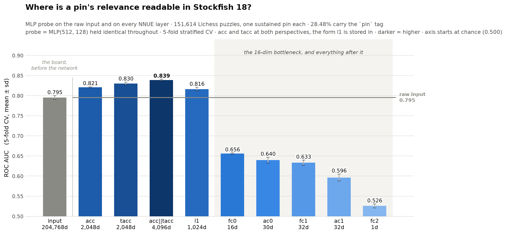

### Objective 2: Depth

The next question was trying to find out how far the net could look into the future essentially.

The experiment above was trying to understand which layer was best at understanding whether a pin was relevant in the puzzle. 
Now we want to find out if it is easier to see that the pin is relevant if it becomes relevant closer in time.
To decide this we can use Lichess' automatic tagging code which goes through the puzzle and looks at where the pin becomes relevant. 
We call this the relevance distance `d`. 

#### Score by distance class trained seperately
So, first instinct is to plot score over `d`.

However, there is one major problem:

Puzzles with higher relevance distances occur less often

| distance | n | mean rating | mean length |
|---|---|---|---|
| 0 | 15138 | 1531 | 1.64 |
| 1 | 8987 | 1667 | 2.13 |
| 2 | 1564 | 2022 | 3.07 |
| 3 | 137 | 2340 | 4.07 |
| 4 | 14 | 2362 | 5.07 |
| 5 | 4 | 2551 | 6.00 |
| 6 | 1 | 2489 | 7.00 |
| negative | 105789 | 1635 | 2.07 |

So the naive approach cannot be trusted if a majority of the puzzles have d=0. 
For this reason, I tried to keep the number of puzzles used in training uniform over d. This didn't really work when d=3 with just 137 puzzles is kept. But especially at several thousand samples we clearly see that the result from the naive approach is actually correct: It is easier to see a pins relevance when it's closer. 

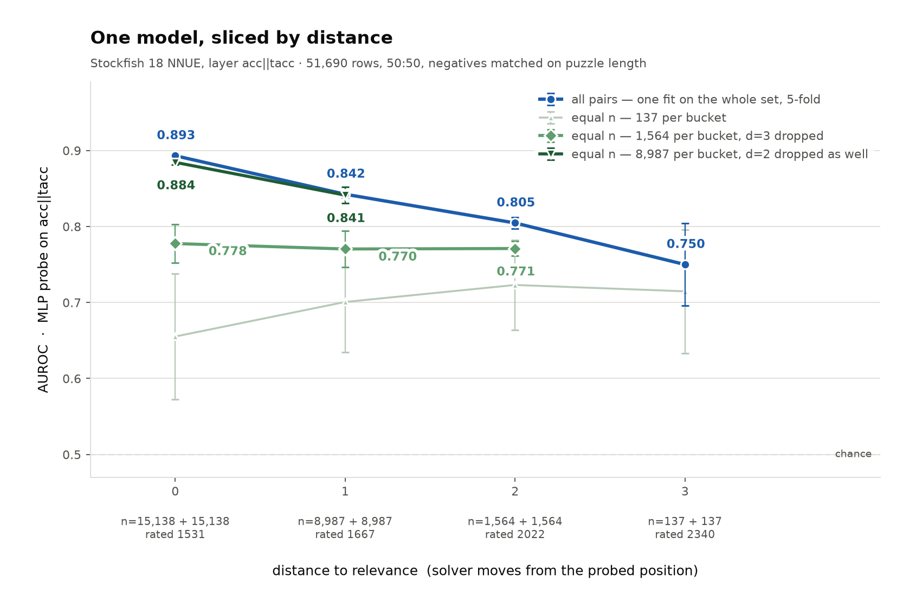

The next step was looking at what happens when we train a seperate model for each depth, choosing negative samples of the same length as the positive samples. Also, I used the opportunity to do a 1:1 ratio between positive and negative samples. 

#### Score by distance class trained seperately

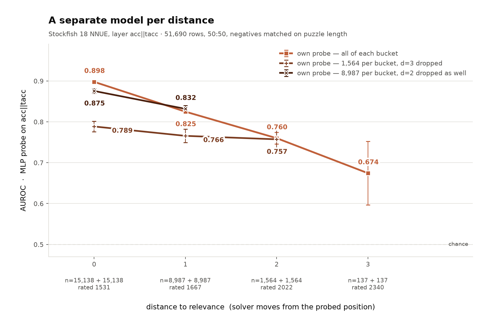

What we can see is that training the model on just puzzles with d=0 for example doesn't make the model better at detecting relevance. Also, the plot almost didn't change. 

#### Classifier

Just for fun, I wanted to try to train a model to predict between the classes d=0, d=1 and negative, if we remove everything else. 

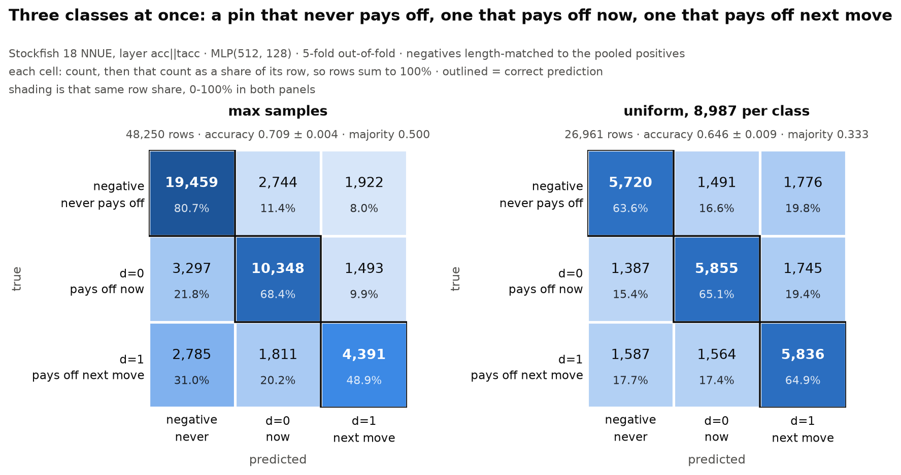

#### Types of pin relevances

The real question is if there are different types of relevances that are more easily detectable than others apart from the relevance depth?

Lichess doesn't really distinguish many different types

1. pin prevents attack vs escape
2. the attacked piece is hanging or more valuable than the pinned piece/the pinned piece is hanging or more valuable than the piece attacking it

This gives 4 options:
1. `attack.hanging`
2. `attack.greater`
3. `escape.hanging`
4. `escape.greater`

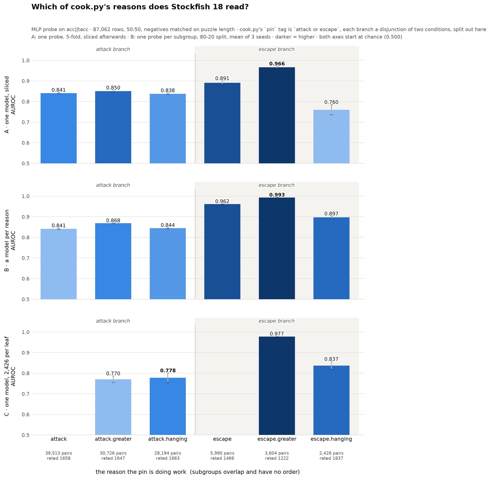

What we see is that escape is consistently easier to read, specifically `escape.greater`


### Objective 3

Goal is to look at the layers of Leela Zero (lc0) just like we looked at Stockfish. 

Before making the experiment the hypothesis was that lc0 would be much better compared to SF because it has a much larger GPU-based tranformer network and there were already some papers showing its trained lookahead in contrast to SF which relies more heavily on tree-search:

1. "Evidence of Learned Look-Ahead in a Chess-Playing Neural Network" by Erik Jenner, Shreyas Kapur, Vasil Georgiev, Cameron S. Allen, Scott Emmons, and Stuart Russell, published at NeurIPS 2024 (arXiv:2406.00877)
2. A 2025 follow-up paper, "Understanding the learned look-ahead behavior of chess neural networks"

#### Experiment

On each layer we have a 256-vector per square which gives 256x65=16384 dimensions.

To keep training feasible, we did two main things:
First we have the pin subset, which is the three squares that are directly involved in the pin. 
Then we have the mean of all squares. 

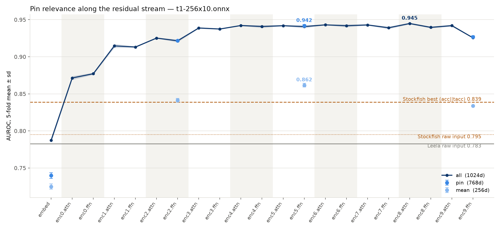

### Objective 1: Example of some chess commentary

The chess commentary is from this paper: ChessGPT: Bridging Policy Learning and Language Modeling


Looking into chess commentary, we can see a lot of redundant simple commentary actually. 

1. Opening
2. Opening
3. Opening/Reference to normal play
4. Factual comment
5. Positional analysis
4. Purpose
5. Explanation (this is what we are actually looking for, in this case a concrete line, with two final reasons, just like we predicted)
6. Psychology
7. Psychology
8. Explanation (Only option that achieves A)
9. Explanation (do X to achieve A)
10. Positional analysis
11. Factual comment, psychology, explanation (Move X because after a some move later open file is occupied which enables move Y which treatens moves Z and W with mate)

Looking at the commentary, it would actually be very easy to build a simple deterministic system to write this commentary. 

#### Precedent: [Jhamtani et al. (ACL 2018)](https://aclanthology.org/P18-1154.pdf)


They already show that the commentary we are looking for, specifically "Planning/Rationale" and what they are calling "Direct Move Description" is also the most difficult to understand for language models. 

The other categories seem pretty simple to solve or are in the contrary almost impossible to generate from just the game itself.
1. Describing a move (what I called purpose) is mostly natural language processing. The most difficult part about this is the high variability. A move often does a lot of things, picking one shows taste. 
2. Move quality is very simple to do just with engines. This is also what chess.com and others are already very good at doing.
3. Comparing alternatives is just a certain way of reasoning, this also includes the exclusion principle, i.e. I am doing this move, because there is no better one. 
4. Planning and rationale is what we are looking for. It actually explains not just what a move is doing in the immediate, but also what the greater plan is that the move is part of
5. Contextual information ad general game comments are not feasible in this setting but would be important in practice. However, they require more context and are out-of-scope for now. 

Chess.com example (https://www.reddit.com/r/chessbeginners/comments/10cwkvw/why_does_chesscom_say_this_is_a_blunder_i/)

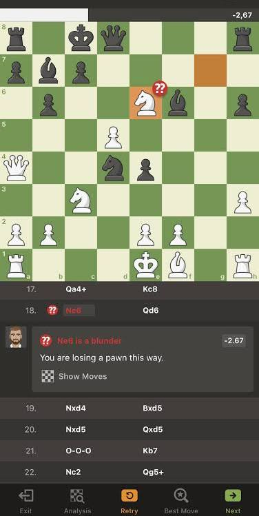

### Predicate Logic?

One possible basis for our language would be something like Prolog:

https://www.cs.rochester.edu/u/nelson/courses/csc_173/predlogic/computation.html

"Example facts:
```prolog
male(adam).
female(anne).
parent(adam,barney).
```

Example rules:

    son(X,Y) :- parent(Y,X) , male(X)
    daughter(X,Y) :- parent(Y,X) , female(X)
  
To run a Prolog program the user must ask a question (goal) by stating a theorem (asserting a predicate) which the Prolog interpreter tries to prove.

If the predicate contains variables, the interpreter prints the values of the variables used to make the predicate true. 
"

For example we could define an absolute pin as the following (more Python-like pseudo-code):

```py
absolute_pin (N,M,K) :- ours(N) and theirs(M) and theirs(K) and is_king(K) and (
        (rook(N) or queen(N)) and on_line_in_order(N,M,K)
    ) or (
        (bishop(N) or queen(N)) and on_diagonal_in_order(N,M,K)
    )
```

### Back to some chess literature

Main idea is to "distill" SF's evaluation function to some more simple model on explainable factors.
For that we need to understand what the factors are. 

So, let's look more at the chess literature. Specifically, literature from the International Chess School (www.chessmasterschool.com) and even more specifically their sample chess lessons from here (https://www.chessmasterschool.com/#program):

1. Think Like a Strong Player
2. Chess Strategy
3. Chess Tactics


Their theses:
1. For each move think about and evaluate the threats and consequences
2. Keep a TODO list with goals you want to achieve (over 3-10 moves)
3. Each move should either give you an advantage or remove an advantage from your opponent

#### What are these advantages?

Wilhelm Steinitz's 9 advantages
1. lead in development
2. mobility of the pieces
3. seizure of the center
4. weak oponnent king position
5. weak squares in the opponent's position
6. superior pawn formation
7. (a pawn majority on the queen side)
8. open files
9. (bishop pair)

The ICS proposes more modern quantitative and qualitative advantages

Quantative
1. Material advantage
2. local superiority of forces

Quantitave advantages are most easy to measure and compare.

Material advantage is probably one of the first things you learn and was the basis for engine evaluations until recently (it has changed to winning probability):

- Pawn: 1 (the unit)
- Knight: 3
- Bishop: 3
- Rook: 5
- Queen: 9

For this reason, knights and bishops are often called light pieces while rooks and queens are called heavy pieces.

The local superiority is quite simple to understand. The chess board is just large enough that locality exists, where something could be happening on one part of the board, where one party has the upper hand just like on a battle field. 

One heuristic: an attack on the opponents king will be successful if you have three more pieces in the attack than the opponent has in the defense. 

Essentially this is global material advantage vs local material advantage. This should be realtively easily measurable. 

Qualitative
1. King's safety (my own sub category)
    - pawns infront intact
    - open files and diagonals to king
    - how many pieces attack and how many defend (attacking and defending resources)
    - Example for worst possible king safety: https://lichess.org/analysis/r2q1rk1/pppb1p2/2n1p3/3pP2Q/3P4/3BB3/PPP2P2/2K3RR_b_-_-_0_1?color=white
2. Qualitative value of pieces
    - Mobility: 
        1. how many fields can the piece move to and 
        2. how little moves does the piece need to cover the entire board
    - Positioning
        1. knight in the center 4x4
        2. other pieces on open lines/diagonals
        3. the more central and the more squares under control, the better
    - Role: tiered
        1. Out of play
        2. Defensive
        3. Offensive
        4. Both offensive and defensive
    - Stability: Can it be removed from its position easily?
        - Existence of outposts -> potential
    - Grade of coordination -> difficult to assess
        1. Sustainment
        2. Protection
        3. Limitation
        4. Attack
        5. Obstruction
3. Pawn structure
    - number of pawn islands
    - isolated pawns
    - free pawns
    - double and triple pawns
    - pawn mobility
4. Space advantage
    - Better control of a certain area of the chessboard by advancing pawns
    - Space advantage increases the qualitative value of pieces -> don't trade if you have space advantage
    - Example where White has maximal space advantage: https://lichess.org/analysis/r1bqnrk1/pp1nbpp1/2p1p2p/2PpPP2/PP1P2PP/2NB1N2/1BQ5/2KR3R_w_-_-_0_1?color=white&position=518
        The evaluation is +6, even though materially there is no difference
5. Initiative
    - Forcing the opponent to respond to your threats instead of his own plans 

For PMEs (positions with material equivalence) also:
1. play-coordinating piece is valued higher

#### Positional evaluation

1. Material (as above)
    - if unequal material, compare
    - if material disadvantage, check compensation
2. Threats and tactical ressources
    - checks, takes, threats
3. King's safety (as above)
4. The centre
    1. control: score as 0-4 to 4-0
    2. type
        - closed
        - open
        - static
        - mobile
        - dynamic
5. Pieces
    1. Development (only in early game)
    2. Pieces out of play
    3. Local superiority
    4. Collaboration
    5. Rooks on open files
    6. Bishops on important diagonals
    7. Knights on important foreposts
    8. Bishop-pair
    9. Safe and active queen
    10. Piece-by-piece comparison
6. Pawns
    1. Space
    2. Weak pawns
    3. Superior pawn structure
    4. Dynamic
    5. Mobile pawn majority
    6. Free pawn

### Extra

Exact space counting method in "Winning Chess" by Silman and Seirawan. 

Other thought: ChessGPT + engine + tools

Eval:
1. LLM judge/human review
2. blue/rouge, embedding similarity
3. keywords/tool calls/structured output

Questions: how large does my eval set need to be?

Possibly: 100 or 1000

1. dspy -> prompt optimization
2. CLIP2 on chess -> this is ChessGPT
3. Activation oracle on leela activation -> where do we get the data?

## Third meeting 10.09.

For next time:
1. Build features (with Claude)?
2. Paper, sparse autoencoder on engine
3. Activation oracle paper
4. Clean up chess commentary dataset
5. Build minimal gold-standard-dataset
6. ChessGPT/Claude/Gemini + Prompt (zero-shot)
7. Datensätze suchen
8. PoC: Pin relevance with LLM/activation oracle

### lc0 depth

Late for last meeting:

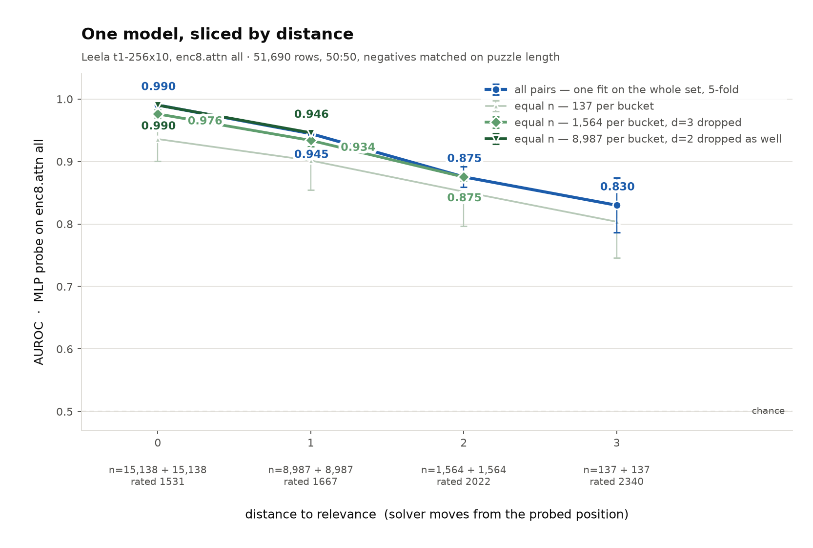

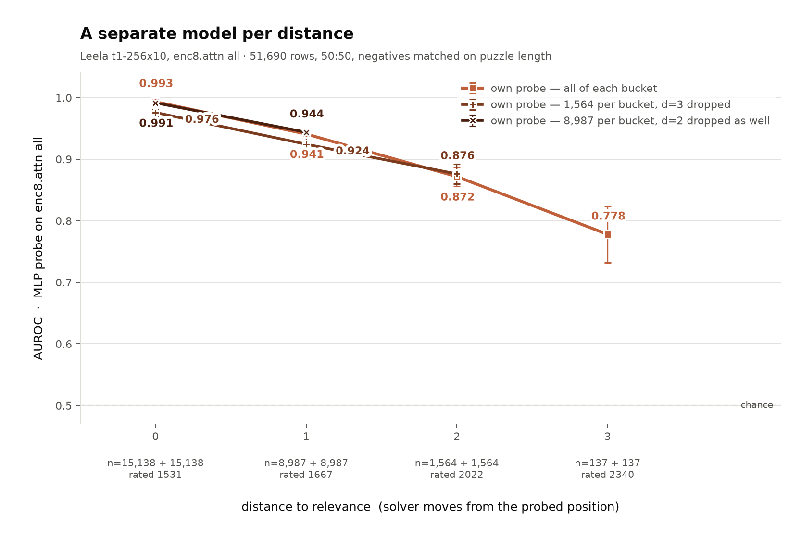

Leela actually reaches 99.3% AUROC on depth 0 and then also degrades quite heavily. No substantial lookahead to be seen in comparison to SF. 

### lc0 by subcategory

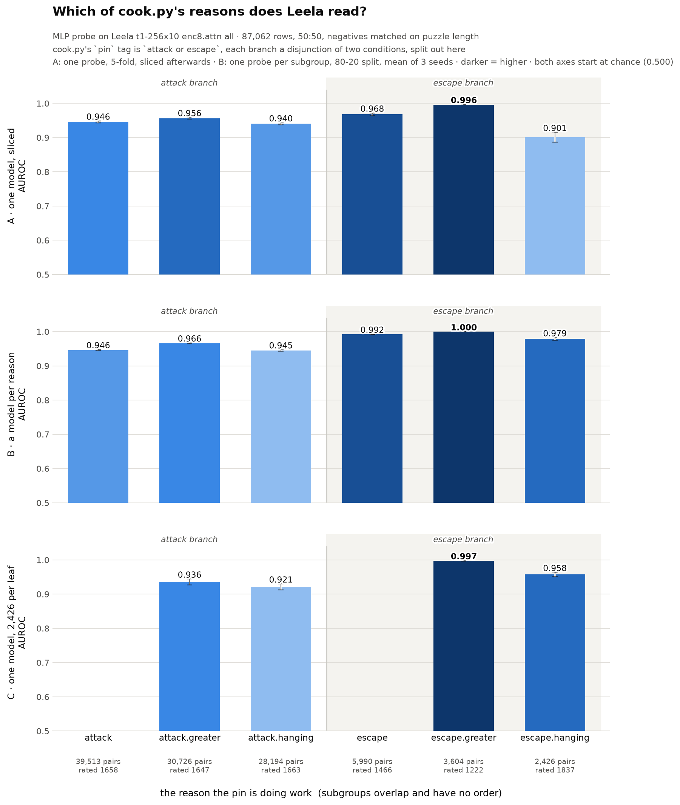

Here Leela reaches a perfect score in one category and shows its superiority over SF especially in the attack category. 
Greater is still easier than hanging for some reason. 

### Dataset

Most simple idea: Take the chess commentary dataset but remove all the "dirt".
Instead of doing this myself, just use Claude instead. 

1. Removed all games without any human commentary.
2. Removed all comments that are not valuable/natural language
    | Rule | Example | Caught |
    |---|---|---:|
    | lichess engine verdict | `Inaccuracy. Rfe1 was best.` | 82,888 |
    | lichess result line | `1-0 White wins by checkmate.` | 14,015 |
    | No letters | `!`, `..`, `?!` | 7,096 |
    | Moves only | `30...Rxd7 31.Bh7+ Kf7` | 1,592 |
    | Bare result sentence | `White resigns.` | 625 |
    | Chess Informant code | `#C5 a5+-`, `RR`, `N` | 511 |
    | Bare ECO opening header | `B18: Classical Caro-Kann: 4...Bf5 sidelines` | 371 |
    | URL only | `https://www.chess.com/tactics/46917` | 277 |
    | Informant name | `Chess Informant` | 103 |
    | **Total dropped** | | **107,478** |
3. Histogram by comment lengths
    
    i.e. if we take the most valuable 10% we still got 60,000+ left which gives us 25M characters i.e. approx 5M tokens

### Experiments

This list is mostly in hindsight

1. Basic prompt + prompt optimization
2. Advanced prompt + thinking
4. Advanced prompt + prompt optimization + thinking + tools
5. Dictionary learning
3. activation oracle (AO)

### Experiment 1: Gemini 3.5 Flash Lite + basic prompt optimization, judged by Claude Sonnet

The most simply setup imaginable:

We take the 2000 best comments and prompt-optimize Gemini 3.5 Flash Lite without thinking on 1700. Then judge the rest of 300 by Claude Sonnet. 

Starting prompt:

    You are a chess annotator. Given the moves of a game so far and the current board, write a short commentary on the last move played, as a human annotator would in an annotated game.

Best prompt after three rounds:

    Before writing, work through the position silently: identify the piece that moved, its origin and destination square, and what it now attacks, defends, or opens up -- check each claim against the actual diagram, not memory. Do not show this reasoning or use headers.\n\nWrite 1-4 plain sentences in the voice of a human annotator noting their own game -- ordinary prose, no markdown, no bold, no bullets, no hype adjectives (\"thematic\", \"ambitious\", \"solidify\", \"razor-sharp\", \"dynamic\"), no generic filler that would fit any position. Prefer plans, ideas, and evaluations of the position over concrete tactical claims: what the move develops, what square or file it gives up or gains, what plan it continues. Name at most one concrete threat -- a specific piece taking a specific square next move -- and only if you have verified it is actually available on this board; otherwise mention no concrete threat at all. Never say who stands better unless the material count makes it obvious. If nothing concrete and verified stands out, write one short, modest sentence. Output only the commentary.

#### Judgement criteria

- **faithful** — every concrete claim about the position, threats, pieces and lines is true.
  5 = all true. 3 = one wrong or unverifiable claim. 1 = mostly wrong, wrong piece/square, or
  talks about a different move.
- **relevant** — it is about the move just played and what matters now, at the same level of
  abstraction the reference uses (a plan, a tactic, an evaluation). 1 = generic opening
  boilerplate or filler that would fit any position.
- **human** — reads like the corpus annotator: a person talking about the game, with a point
  of view and normal length. Penalise engine-voice, bold headers, bullet lists, textbook tone,
  and exaggerated adjectives ("thematic", "ambitious", "solidify", "signals intent").
- **overall** — would a strong club player accept this in place of the reference? Weigh
  faithfulness most.

#### Eval

The Sonnet judgements out of 5

| Candidate | n | Overall | Faithful | Relevant | Human | Paired W/T/L | Δ |
|---|---|---|---|---|---|
| baseline | 299 | 2.70 | 3.02 | 3.13 | 2.78 |
| best | 257 | **3.06** | 3.17 | 3.48 | 3.83 |

#### Understanding

Essentially, the main point is that be improving the prompt and increasing its length, we can mostly improve human-like behaviour and relevance slightly. However, we cannot improve faithfulness by any measure. For this, we would need a source of truth. Overall 3/5 is a very bad score of course. 

### Experiment 2: Gemini 3.5 Flash Lite with thinking + advanced prompt, judged by Claude Sonnet

Next idea: do the exact same thing as before but feed a 22 page PDF instruction meant for humans and add thinking. 

Also, to prepare the next stage, feed Gemini's thinking into the judge and ask it what tools would have helped Gemini to better follow the instructions and where it went wrong. 

One problem with this: Claude Sonnet is probably not much better than Gemini 3.5 Flash Lite. 

I first took the three publicly available PDFs from the ICS website and fed it into Fable to convert it into Markdown.

Then I asked Fable to set up the experiment. 

#### Setup

Only the 300 dev cases first

*Gemini input*

What Gemini gets (one user message per example, gemini-3.5-flash-lite, temperature 0.7, thinking level medium with thoughts returned, max 4000 output tokens):

    The following chess lessons are background reading. Use their ideas and vocabulary where they apply to the position; do not quote or cite them.

    === BEGIN LESSONS ===
    <chess_school_intro.md verbatim, 42,804 chars>
    === END LESSONS ===

    <best.json instruction, unchanged:>

    --- Example ---            (x3: train-0343, train-0956, train-0610, same demos as best.json)
    Moves so far (the last move is the one to comment on):
    <moves>

    Board after <move> (<side> just moved; uppercase = White, lowercase = Black, rank 8 at the top):
    <ascii board>

    Commentary:
    <human comment>

    --- Your turn ---
    Moves so far (the last move is the one to comment on):
    <moves>

    Board after <move> (...):
    <ascii board>

----

[*Judge input*](./commentary_gen/JUDGE2.md)

#### Expectations

My expectations were rather low. I assumed the full PDF was too much context and not precisely enough tuned on just commentary/positional analysis. 

However, I still believed there would be some improvement and most importantly I was interested in the main mistakes found and tools requested.

Lovable had already done some research on how LLMs are pretty good at identifying what would help them improve their own work [no citation]. So, maybe this is true here as well.

#### Results

I am just using the raw Fable output here

    ┌───────────────────────┬─────────┬──────────┬──────────┬───────┐
    │                       │ overall │ faithful │ relevant │ human │
    ├───────────────────────┼─────────┼──────────┼──────────┼───────┤
    │ r2 winner             │ 3.06    │ 3.17     │ 3.47     │ 3.83  │
    ├───────────────────────┼─────────┼──────────┼──────────┼───────┤
    │ r4 lessons + thinking │ 3.04    │ 3.93     │ 3.20     │ 3.41  │
    └───────────────────────┴─────────┴──────────┴──────────┴───────┘

    Faithfulness jumped because the model asserts less. Human and relevance fell because the lessons' vocabulary leaks straight into the output ("increase the qualitative value of my pieces", "update my to do list") and the voice drifts to textbook. One caveat: the previous run had thinking off (Flash-Lite's default), so lessons and thinking are conflated here.

    Of 300 outputs: 96 contain a false claim, 101 are true but generic, 103 were accepted.

    Mistake categories, built from reading all 300 notes (multi-label):

    - 128 true but generic: the hanging piece, fork, mate or tempo attack the reference is about is never mentioned.
    - 37 phantom or vanished piece: "Nxe7 takes a rook" (it's a bishop), a knight "trapped on a8" two moves after it was traded, "my e2 bishop" that belongs to Black.
    - 35 geometry: Nf3 "defends e4", a rook "hits h5" through its own h4 pawn, Bh6 "attacks g8".
    - 32 evaluation inverted: praises a move the annotator calls a blunder.
    - 31 material or count wrong: "my rooks" with one rook, bishop pair with one bishop, a full rook down unnoticed.
    - 30 square called undefended or vacant that is covered or occupied.
    - 28 side or direction backwards: narrates from the wrong colour, or attacks the wing the king isn't on.
    - 22 light/dark bishop swapped, including the Stonewall and French "bad bishop" both backwards.
    - 18 "open file" with a pawn still on it; 15 rooks "connected" with pieces between; 15 "forced" where alternatives exist or the capture is illegal.

    Thinking vs output: in 25 items the thinking has an error the output dropped, so the hedging instruction works. In 12 the output invents something the thinking never checked. The thought summaries are short and rarely do square-by-square verification; when they do, the misread is already in them.

    Tools the judges asked for, counted the same way:

    - 98 per-piece attack/defence map with blockers.
    - 82 piece inventory: what sits on square X, king locations, material count.
    - 68 short forcing-line search: checks, forks, mates, "is this capture safe".
    - 28 hanging-piece scan, 25 pawn-structure classifier, 21 board predicates like back-rank connectivity.
    - 19 opening book, 18 square colour, 17 per-file pawn census, 12 legal-move list.
    - 7 engine evaluation. Almost never wanted.
    - 94 none, of which 76 are clean items.

    The first two rows are cheap python-chess lookups and cover nearly every factual error. The third is what would separate generic from on-point, and needs a shallow search rather than an engine score.

Further pushing it on the faithfulness vs relevance dynamic

    The reference is the human annotator's original comment on that move, which the judge sees next to Gemini's output. "Never mentioned" means Gemini's text says nothing false, but the concrete fact the human built their comment around is absent from it.

    Example from dev-0148: the human comment points out that Qxe4 wins a knight for free because the f5 pawn is pinned. Gemini wrote about repositioning the a3 knight and king safety. Every sentence is true, so faithful scored 5, but overall scored 1 because it walked past the whole point of the position.

    That was the largest category, 128 of 224 flagged items. The judges were told to grade relevance "at the same level of abstraction the reference uses", so when the human names a fork or a hanging piece and Gemini offers "pressure on the kingside", it gets marked as missing the point.

This is the classical problem even humans face in tests. If you have no idea, your best bet is to just waffle on about irrelevant but factually true things. The diificult part is not saying true things, but it's actually to stay both factual and relevant at the same time. 

Just a general caveat. Due to the size of the test set at 300, it is already difficult to not use an LLM judge and mostly rely on Sonnet and Fable to not just make up stuff or hallucinate. I would not consider this completely serious research at this point. 

These are the specific tools Fable proposed:

    - Attack map: for the moved piece and any named square, list what it attacks and what attacks or defends it, with blockers respected. Covers the geometry, undefended-square, open-file and "rook supports d4 through the queen" errors.
    - Piece inventory: piece-by-square list for both sides after the move, plus material count and king squares. Covers phantom or vanished pieces, wrong captured piece, "my rooks" with one rook, wrong bishop colour.
    - Hanging-piece scan: every piece with more attackers than defenders, pin-aware. Covers the missed free captures and missed counter-threats.
    - Forcing-move probe: all checks and captures for the side to move, one or two plies, with whether each is safe. Covers missed forks, mates and tempo attacks, and the "forced" claims that weren't.
    - Move legality: is this named move legal from here. Cheapest of all, kills the illegal-plan errors.
    - Pawn-structure labels: isolated, doubled, backward, passed, half-open files. Small but the mislabels are consistent.

Some of these seem not absolutely trivial to build (e.g. pawn-structure)

### Experiment 3: Gemini 3.5 Flash Lite with thinking + optimized advanced prompt + tools, judged by Claude Sonnet

First, lets just optimize the prompt a bit more. I wanted to remove most of the part that is about deciding which move to play and just keep the positional analysis part. This also dropped the length quite a bit by almost half. 

Fable built the tools, but I already knew they would be broken, so I let four subsequent reviewers find and eliminate the bugs. For a publication or similar, this would have to be double-checked and maybe even re-written by hand. 

To explain the motivation of using tools a bit more. Tools have several purposes. Firstly, they prevent hallucinations like illegal moves and "Nf3 attacks e4" etc. Secondly, they are one way of "translating" between natural language and deterministic chess logic and thirdly, they give the LLM full control of what it wants and needs to know without predetermining what it should know by precomputing everything and just handing it to the LLM as input. This is both necessary when we have a large search space and just provides more freedom. 

Updates:

1. Minimize the instructions to the minimal necessary. Remove all redundancies and write it into one smooth prompt for the LLM. Make it a step-by-step recipe that can be followed easily. 
2. Add the tools to the prompt and implement tool use
3. Check if the tools that were supposed by the judges are actually used by the LLM in the dev set
4. Do prompt optimization steps on the training set for the full prompt including the shortened chess school prompt and the tool prompts, then run it on the dev set.

#### First with all tools executed and injected into prompt

Overall result

    ┌───────────┬─────────┬──────────┬──────────┬───────┐
    │           │ overall │ faithful │ relevant │ human │
    ├───────────┼─────────┼──────────┼──────────┼───────┤
    │ r2 winner │ 3.06    │ 3.17     │ 3.47     │ 3.83  │
    ├───────────┼─────────┼──────────┼──────────┼───────┤
    │ r4        │ 3.04    │ 3.93     │ 3.20     │ 3.41  │
    ├───────────┼─────────┼──────────┼──────────┼───────┤
    │ r5        │ 3.37    │ 4.02     │ 3.66     │ 3.80  │
    └───────────┴─────────┴──────────┴──────────┴───────┘

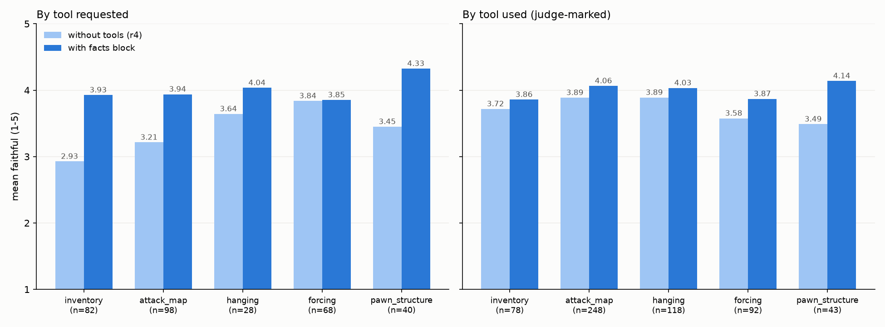
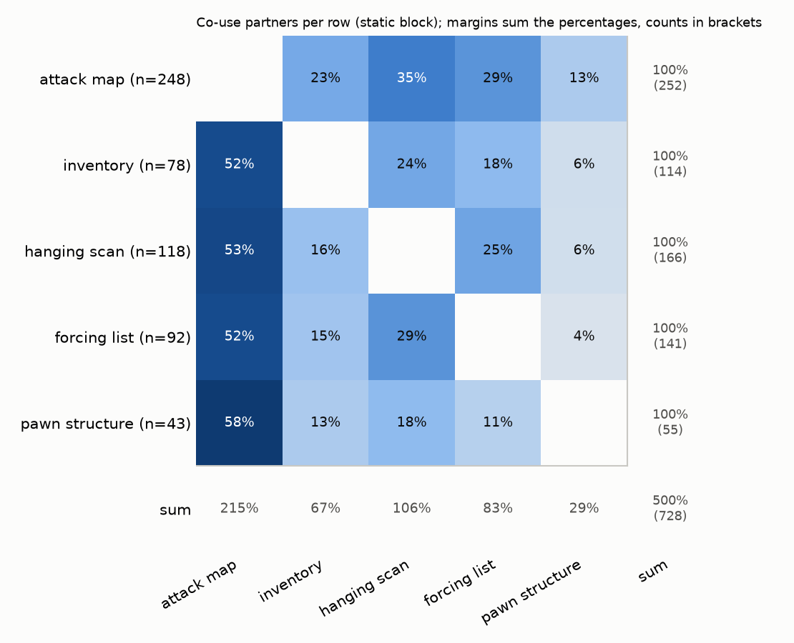

#### Second with real tool calling

Tool calling isn't generally an improvement because it is just easier to dump everything into the prompt at this point. 

An `after` tool is added for the engine to play moves into the future.

Generally, the LLM just isn't really helped because it just has no intuition of chess and constantly makes simple mistakes. 

A hand-tuned system prompt with an extremely tight instruction + lots of pointers to tools might make a difference but the core is and will always be rotten. 

    ┌───────────┬─────────┬──────────┬──────────┬───────┐
    │           │ overall │ faithful │ relevant │ human │
    ├───────────┼─────────┼──────────┼──────────┼───────┤
    │ r2 winner │ 3.06    │ 3.17     │ 3.47     │ 3.83  │
    ├───────────┼─────────┼──────────┼──────────┼───────┤
    │ r4        │ 3.04    │ 3.93     │ 3.20     │ 3.41  │
    ├───────────┼─────────┼──────────┼──────────┼───────┤
    │ r5        │ 3.37    │ 4.02     │ 3.66     │ 3.80  │
    ├───────────┼─────────┼──────────┼──────────┼───────┤
    │ r5_tools  │ 3.17    │ 4.06     │ 3.31     │ 3.63  │
    └───────────┴─────────┴──────────┴──────────┴───────┘

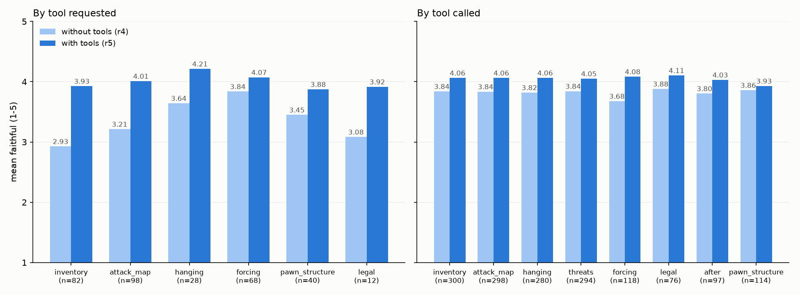
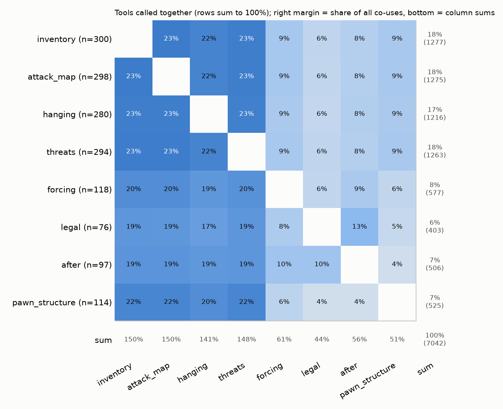

#### Three with even tighter prompt + most tools injected + more advanced tools

The prompt is just a bit tighter with an explicit step-by-step procedure and the tools are all injected (additional tools: `change`, `alternatives`, `king_safety`, `piece_quality`, `space`) except for some were the model can play through (`after`, `legal`, `attack_map`). Also an additional tool use judge metric.

    ┌───────────┬─────────┬──────────┬──────────┬───────┬──────────┐
    │           │ overall │ faithful │ relevant │ human │ tool use │
    ├───────────┼─────────┼──────────┼──────────┼───────┼──────────┤
    │ r2 winner │ 3.06    │ 3.17     │ 3.47     │ 3.83  │ —        │
    ├───────────┼─────────┼──────────┼──────────┼───────┼──────────┤
    │ r4        │ 3.04    │ 3.93     │ 3.20     │ 3.41  │ —        │
    ├───────────┼─────────┼──────────┼──────────┼───────┼──────────┤
    │ r5        │ 3.37    │ 4.02     │ 3.66     │ 3.80  │ —        │
    ├───────────┼─────────┼──────────┼──────────┼───────┼──────────┤
    │ r5_tools  │ 3.17    │ 4.06     │ 3.31     │ 3.63  │ —        │
    ├───────────┼─────────┼──────────┼──────────┼───────┼──────────┤
    │ r6        │ 3.76    │ 4.50     │ 3.95     │ 3.98  │ 3.88     │
    └───────────┴─────────┴──────────┴──────────┴───────┴──────────┘


Fable:

    Still open:
    - Deeper tactics are still missed. Examples are the Ruy Lopez pawn won back by a queen fork, gambits, sacrifices and the back-rank mate. The sheet sees only the move and the reply, so these need a real search.
    - Four new notes call a recapture "forced" when other replies are legal. Softening the sheet's wording should fix this.
    - The comparison mixes judges and the per-batch judge spread is wide: 3.28 to 4.32 overall. [Judge prompt](./commentary_gen/JUDGE6.md)

#### ChessGPT

Downloaded and tried to run the benchmark on ChessGPT

Problems:
1. That's the data ChessGPT is trained on -> memorization
2. Fine-tuned on 1024 tokens and max limit of 2048 tokens (too little for real reasoning)
3. Fine-tuned too hard -> Lost chat capabailities (or never had any)

### DSL

PoC: Just express "This move threatens mate"

```rs
// Simple move
type Move_ = &'static str;

// A reason for a move, e.g. "this move mates in 2", or "this move threatens to win material".
enum Reason {
    And(Box<Reason>, Box<Reason>),
    Mate(Vec<Move_>),
    Threatens(Vec<Move_>, Box<Reason>),
    WinMaterial(Vec<Role>),
}

/// Reasoning about a move in a position
struct Reasoning {
    pos: Chess,
    mov: Move_,
    reason: Reason
}

// Fried Liver, 1.e4 e5 2.Nf3 Nc6 3.Bc4 Nf6 4.Ng5 d5 5.exd5 Nxd5 6.Nxf7 Kxf7 7.Qf3+ Kg8??
let fen = "r1bq1bkr/ppp3pp/2n5/3np3/2B5/5Q2/PPPP1PPP/RNB1K2R w KQ - 2 8";
let pos: Chess = simple_parse(fen);

Reasoning {
    pos: pos.clone(),
    mov: "Qxd5+",
    reason: Reason::Mate(vec!["Qxd5", "Bxd5+", "Be6", "Bxe6#"]),
};
```

#### Let Claude ride wild

I then let Claude loose on the whole thing and asked it to create the full DSL

    "[C]omplete the language until we can represent all commentary from the dataset about reasons for moves completely.

    Make a new file dsl_claude.rs and write everything in there

    Keep to the absolute necessary and only write the reasoning plus for each new reason add the example inclu[d]ing the fen position + move and original comment"

#### What it did

It wrote a total of 53 `Reason`s each with a natural language description of what they represent:

- Combinators that wrap other reasons: `And`, `Threatens`, `After`, `Allows`, `Prevents`, `Loses`, `Only`, `NoMove`, `Instead`, `Sacrifice`, `Not`, `Because`, `Outweighs`, `Permanent`, `Faster`, `Suppose`.
- Board facts: `Mate`, `WinMaterial`, `Material`, `Trade`, `Attack`, `Pin`, `Defend`, `Overload`, `Decoy`, `Block`, `Open`, `Control`, `Pressure`, `Outnumber`, `Weak`, `Develop`, `Active`, `Better`, `Coordinate`, `Castle`, `Tempo`, `BishopPair`, `Passer`, `Majority`, `Promote`, `Enables`, `Options`, `SameColour`.
- Evaluations: `Simplify`, `Space`, `Initiative`, `Closed`, `Imbalance`, `Zugzwang`, `Draw`, `Win`, `Practical`.

Claude even wrote minimal verifications that didn't need an engine without being asked. These are neither complete nor proofs of any kind, but they at least test plausability. 

#### What's missing

Fundamentally
1. No generator -> LLM?
2. No verifier?

My thoughts split by core and language

- Core
    1. Often the dsl representation can be reached from the natural language comment, but the natural language comment would be difficult to reproduce from the reasoning (one-way/reduction)
    2. Just a reasoning without a judgement doesn't make sense often, i.e. we need first the judgement (e.g. this is a solid move), then reason why that judgement. Most judgement calls like brilliant/excellent/good/solid/average/weak/mistake/blunder can be easily verified (e.g. see chess.com/lichess analysis, or simple engine eval delta), others would be more difficult maybe.
    3. A lot of the complexity hides in little `enum` cases (e.g. `Because`)
    4. No clean map between some of our previously determined tactical patterns and the current `Reason`s
- Language
    1. Real commentary has a lot of fluff around it, like player names, hopes, wishes and (often wrong) thoughts, mentions of historical events, etc.
    2. Real commentary has lots of variety for expressing the exact same thing in our DSL (also due to the reduction)
    3. 


#### Example 1:

    Reasoning {
        fen: "1rbr2k1/2Rn1ppp/1P1q4/p2p4/P2B4/4P3/4B1PP/3Q1RK1 w - - 1 28",
        mov: "Bd3",
        comment: r#"I was pleased to find this move, which isquiet but effective. The bishop is centralized and now threatens action on thekingside against Black's weakly defended king. Black's pieces are too tied up onthe queenside to be able to defend against White's sudden threats."#,
        reason: And(vec![Active("d3"), Pressure(vec!["h7"])]),
    }

1. Player comments on his own pleasedness about his own move (language)
2. Judgement: Quiet but effective is lost
3. Centralized is a subset of active
4. The general comment of threatening the king side is lost and the fact that the king is weakly defended
5. The fact that "Black's pieces are too tied up on the queen side" and that is the reason for the weakly defended king is also lost. 

### Experiment X: Dictionary learning/SAE/feature attribution

#### Motivation

If we look at most models, we have the input layer which is very strongly mapped to the actual input, then we have deeper layers which carry the deeper meaning behind the input which is step-by-step used to at the end reach the final output. 

If we want to understand what the model is really doing, we need to look inside it which is quite tedious, up to impossible for large models and doesn't necessarily generalize over models. Also, single neurons and layers might not always do what we think but have multiple different roles etc. 

If we treat the model as a black box we can only change input and output which gives us information on how the input acts on the output. However, if our input is very plain, this is not really interesting. 

The sparse autoencoder (SAE) is an approach that forces a layer in the model to become more seperable which makes it easier to explain that layer. However, we still need to find out what each neuron actually means which can be quite difficult still. 

Then we have feature attribution which tells you how important a single input feature is. 

My approach is very simple, instead of using the plain input which gives us very minimal information when using feature attribution (see some comments above), we can use a more complex input that gives us much more valuable information.

For example, if our input is just the board, we can understand which pieces are relevant and how much, that's basically it. However, if our input is for example "White has space advantage", then we can say whether the space advantage is important for the evaluation. 

Also, it might be that if we provide very complex features that are not easily replicable in a 10-layer transformer like Leela, we could essentially skip ahead a few layers. This is highly speculative but possible. 

#### Features

I am having big problems making a complete list of all possible features if I am honest. 
My perfectionism doesn't allow me to try an incomplete set. 

### Experiment Y: Activation oracle (AO)

Inspired by the paper: [ACTIVATION ORACLES: TRAINING AND EVALUATING LLMS AS GENERAL-PURPOSE ACTIVATION EXPLAINERS (Jan 2026)](https://arxiv.org/pdf/2512.15674)

They quite nicely summarize the idea in this graphic from the paper


The AO is trained on reading the activations (i.e. the hidden thoughts) from the tested model. 
So, maybe we can use this to train an LLM on the activations of Leela. 
Essentially, the model would learn to verbalize the non-verbal thought of Leela. 
If this would actually work, it would be the absolute pinnacle of what we are trying to achieve. 
Especially, considering the fact that transformer models can reach ["Grandmaster-Level Chess Without Search"](https://huggingface.co/papers/2402.04494)

#### Problem I am having with the oracle

Suppose we have functions f, we want the oracle to learn, i.e. to be able to provide their answer from the Leela activations when asked: If these functions are deterministically determinable, then how can the oracle be better than agent that has direct access to functions f? The oracle could only become better than the tool use agent if it had sufficient non-generated (i.e. human) data. 


### Other

Adam Karvonen ([GitHub](https://github.com/adamkarvonen)) seems to be an interesting person. He is the author of the AO paper and also did research on GPT3's chess playing ability (where he trained linear probes on GPT), sparse autoencoders (SAEs) and dictionary learning as well. He is currently working at Anthropic (Jan 2026). 

#### Caïssa AI
I actually found the Prolog predicate neuro-symbolic engine I was looking for: ["Caïssa AI: A Neuro-Symbolic Chess Agent for Explainable Move Suggestion and Grounded Commentary" (2025)](https://dl.acm.org/doi/10.1007/978-3-032-02813-6_11).

[GPL-2.0 open source code](https://github.com/MazenS0liman/Caissa-AI)

    We present Caïssa AI, a neuro-symbolic chess agent that augments LLM-generated move commentary with symbolic reasoning, knowledge graph integration, and verification modules. Caïssa AI combines a fine-tuned chess-specific LLM with a Prolog-based rule engine encoding chess tactics and rules, along with a dynamically constructed Neo4j knowledge graph representing the current board state. This hybrid architecture enables the system to generate not only accurate move suggestions but also coherent, strategically grounded commentary. A LangGraph-based verification module cross-checks LLM outputs against symbolic logic to ensure consistency and correctness, effectively mitigating hallucinations. By aligning data-driven generation with formal domain knowledge, Caïssa AI enhances both trustworthiness and explainability. Our results demonstrate that this tight neuro-symbolic integration produces verifiable, high-quality commentary and serves as a generalizable blueprint for AI systems requiring real-time, interpretable decision support.

This could definitely be a starting point, but it is lacking a lot on the chess side. Also, I would like to question whether the Neo4j db is actually even valuable or useful


#### Paper: "Learning to Generate Move-by-Move Commentary for Chess Games from Large-Scale Social Forum Data" (ACL 2018)

https://aclanthology.org/P18-1154.pdf
https://github.com/harsh19/ChessCommentaryGeneration

1. Variety in commentary -> generator can't know for sure what category the ground truth is.
2. Adding threats as features helps
3. BiLSTM

#### Paper: "Unveiling Concepts Learned by a World-Class Chess-Playing Agent" (IJCAI-23)

https://www.ijcai.org/proceedings/2023/0541.pdf

Global explanations and concept probing on basic concepts. 

#### Paper: "Communicating Chess Strategies in Natural Language" (13.07.2026)

https://arxiv.org/html/2607.11486v1

Mostly about the prompting techniques how to generate good commentary from a natural language point of view

Key Findings (from Google AI summary, nothing new except for 2 maybe):
1. Evaluating strategies beyond just the primary predicted line ("main line") matters a lot.
2. Purely concept-based descriptions have strict limits because they miss concrete moves.
3. Relying on LLMs to judge these explanations isn't as reliable as real human evaluation.

My understanding: We can differentiate between metrics of natural language and the core of explainability, but there is one major overlap: the relevance/focus.

    Language            Core
    1. Human factor |   
    2. *Focus*      |   1. Correctness
    3. Variety      |   2. Relevance
    4. Context      |

This means: if an explanation is correct and relevant, it is a good explanation, but in a practical setting, you also need to add the human aspect (e.g. humour or emotions), you need to focus on the most important aspect and only expand further when asked, you need to provide variety and you need to keep context (e.g. over a game, over a set of games or over a conversation).

This is why I argue for a two-step process. One that first generates and validates the core explanation in a possibly non-human form. Then another step that generates a natural language explanation based on that core. This makes sure, all metrics and criteria are satisfied. 

The prompt engineering we did, is essentially such a process. The tools provide the core explanation (at least partially) judged as `faithfulness` and `relevance` and the LLM prompted correctly, provides the language factor (summarised as `human`). 

#### MA Thesis: "Explainable Chess AI: A Browser Extension for Move Explanation and Analysis in Real-Time Chess Interfaces" (10.12.2025)

https://github.com/NSM1997/chessAI

Interesting stuff

#### Paper: "Exploring Explainable Multi-agent MCTS-minimax Hybrids in Board Game Using Process Mining" (24.09.25)

https://arxiv.org/pdf/2503.23326

Not viable for chess (only 3v3 checkers), plus bad interpretability and focuses on what was played, not so much on what wasn't.

### Next

1. LLM that is prompted to analyse a position and conclude an eval -> RL on the eval (expensive, but interesting)
2. [LatentQA](https://arxiv.org/abs/2412.08686)/[activation oracles](https://arxiv.org/abs/2512.15674) -> build a dataset mapping lc0 activations to natural language descriptions starting by eval and them going to more and more complex concepts up to then doing full explanations -> to read what to consider: https://arxiv.org/abs/2607.23379
3. Actually build the verifiable language on a minimal example

#### How to get more data?

1. Books -> difficult to obtain, digitalize and bring in a suitable form
2. Lichess studies -> discovery problem
3. **YouTube (YT) Videos**: This is the most interesting, lots of digital data, easy to discover, but difficult to scrape, computer vision and transcription problems

Claude's research result on that

    The research note is at paper/yt-shorts-extraction.md (not committed). The agent tested the pipeline on one GothamChess Short (pKuCQA3HXck) and deleted the downloaded video afterwards.

    Recommended pipeline, starting with Shorts that screen-record a digital board:

    1. Listing: yt-dlp --flat-playlist on a channel's /shorts tab. This worked.
    2. Transcript: YouTube's auto-captions come with a timestamp for every word, free. This worked. faster-whisper with a chess-vocabulary prompt is the fallback where captions are missing.
    3. Board reading: tsoj/Chess_diagram_to_FEN (MIT licence) found the board and read the exact position from a full 9:16 frame with facecams, at both 1080p and 360p. Nearly all its errors were frames caught mid-move.
    4. Frames to moves: match each new frame against the legal moves with python-chess. A rough version rebuilt a fully legal 32-ply game from the test Short and threw out 23 noisy frames. It broke when a move happened between two samples (it sampled 2 frames a second). This step needs a proper search over legal moves that can bridge a missed move, plus a reset when the video cuts to a new position. The agent found no existing code for this; it's the one part we'd have to write.
    5. Checking positions: Lichess puzzle DB, cloud eval, the masters explorer (needs a Lichess token) and Stockfish.
    6. Output: PGN with a set-up start position and comments tied to move ranges, the same shape as cleaned_commentary/.

    Prior work: ChessGPT built a set from about 83K YouTube videos by reading boards from frames. They judged it too noisy to use and didn't release it, citing legal issues. Agadmator-2K (arXiv 2609.00474) lines up about 500 hours of narration with games whose moves were already known, so it doesn't read boards at all. The agent found no dataset made from Shorts.

    Main risks:
    - Legal: YouTube's terms forbid downloading and automated access. The German research exception (§60d UrhG) covers making copies for non-commercial research, not publishing them. We could release only video IDs, timestamps, PGN and code. Shorts under a CC BY licence are the only fully clean subset.
    - Commentary with no chess in it: the test Short's board was read correctly, but its audio was pure reaction ("HOLY MOLY… I win on time?"). Expect a filter for chess-relevant speech to drop a large share.
    - Commentary out of step with the board: speakers talk ahead of or behind what's on screen.
    - Untested visuals: only chess.com's default board was tried. Arrows, other themes, flipped boards and physical boards haven't been tested, and physical boards are much harder.
    - Unknown start state: side to move and castling rights can't be read from the first frame.
    - Spoken notation: how well Whisper transcribes moves like "knight takes e5" hasn't been measured.

    The cheapest next step is probably to run the pipeline on about 50 Shorts from one channel and measure how many survive the chess-relevance filter. That number decides whether this source is worth building.

I agree with almost everything Claude says: This should work in general, but some filtering still needs to be done and there are still some technical difficulties. However, you could probably find a channel that almost exclusively publishes a certain type of content in comparison to Gotham who does a lot of different formats. 

For example, here is an extraction from the YT channel "You Me And Chess"

    Fishing Pole Trap — You Me And Chess
    Start: the normal starting position, White to move.

    The Fishing Pole Trap starts with:

    1. e4 e5 2. Nf3 Nc6 3. Bb5
    White attacks Black's knight.

    3… Nf6
    Black ignores it.

    4. O-O Ng4
    Attacking the pawn on h2.

    5. h3
    White gets extremely uncomfortable.

    5… h5
    Instead of moving the knight.

    6. hxg4
    White gets happy and captures the knight.

    6… hxg4
    Black captures back, and now the knight on f3 is under attack.

    7. Ne1
    So it moves to e1.

    7… Qh4
    The crushing move, threatening mate on h2.

    8. f3
    To create room for the king on f2. But it's too late:

    8… g3
    Black takes away that square.

    9. a3
    Now White has to make a random move.

    9… Qh2# Checkmate. 0-1

This looks really clean!

#### Tree-search explanation

Lots of explanations are about the lines that do not work -> not only explain why a line works, but also why one doesn't. 

How do we do this?

How do we find the balance between abstract, positional considerations and concrete lines?

How do we determine moves that seem reasonable but aren't and moves that are very good, but don't seem reasonable?

-> Reasonability is highly subjective -> MAIA-3?

#### Questions

1. Tracing the Thought of a Grandmaster-level Chess-Playing Transformer
2. 
3. Compute